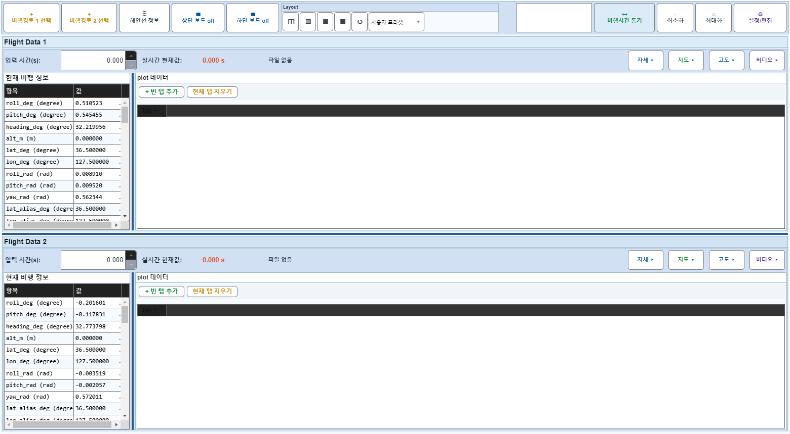
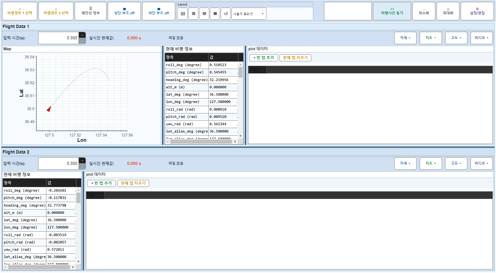

# Case 03: A03 보드1 지도/고도 off

- **그룹**: A
- **기대 결과**: 보드1 map 숨김
- **관측 결과**: `PASS`

## 액션 시퀀스

| Step | 액션 | 캡처 |
|------|------|------|
| 01 | baseline (data loaded) |  |
| 02 | 보드1 지도/고도 off |  |
