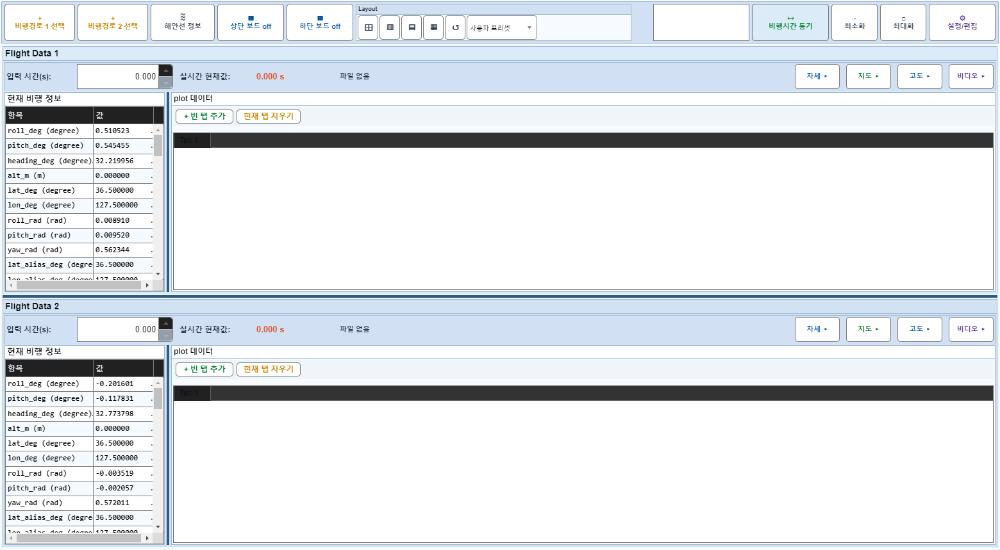
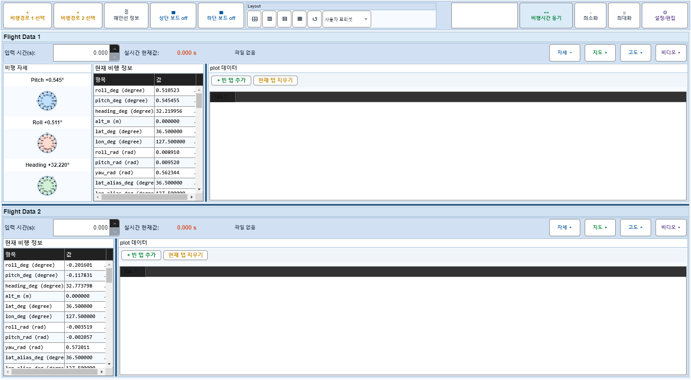
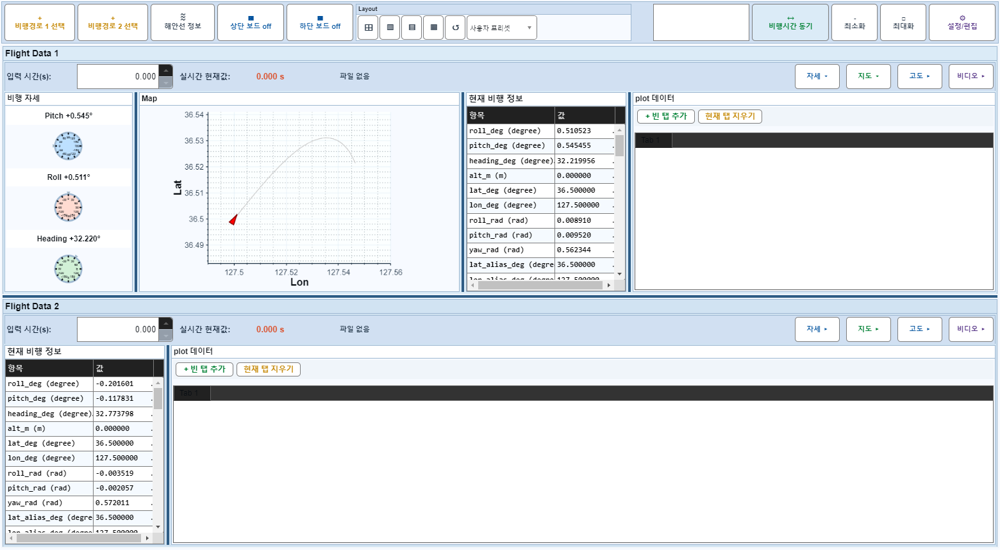

# Case 05: A05 보드1 자세+지도+비디오 모두 off

- **그룹**: A
- **기대 결과**: 3개 동시 숨김, H 1x 흡수
- **관측 결과**: `PASS`

## 액션 시퀀스

| Step | 액션 | 캡처 |
|------|------|------|
| 01 | baseline (data loaded) |  |
| 02 | 자세 off |  |
| 03 | 지도/고도 off |  |
| 04 | 비디오 off |  |
