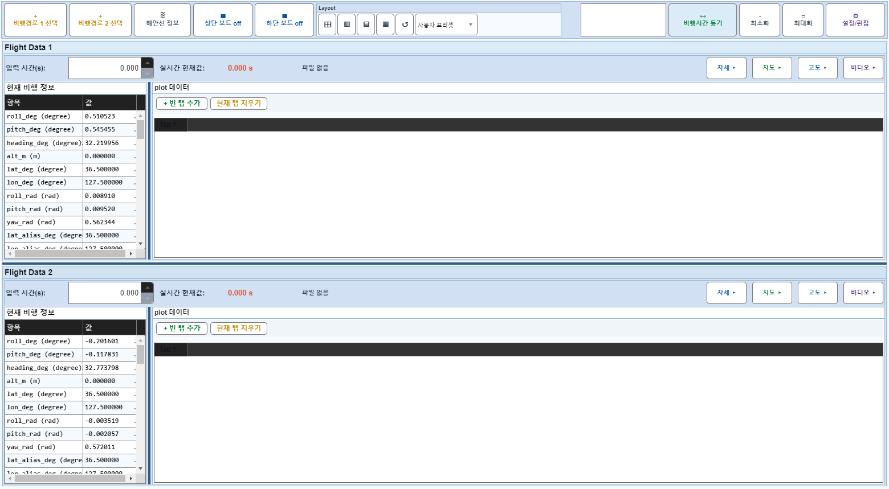
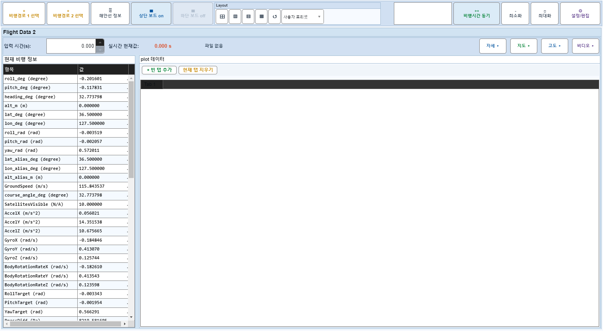

# Case 06: B01 보드1 off→on

- **그룹**: B
- **기대 결과**: 왕복 정상
- **관측 결과**: `PASS`

## 액션 시퀀스

| Step | 액션 | 캡처 |
|------|------|------|
| 01 | baseline (data loaded) |  |
| 02 | 보드1 off |  |
| 03 | 보드1 on |  |
