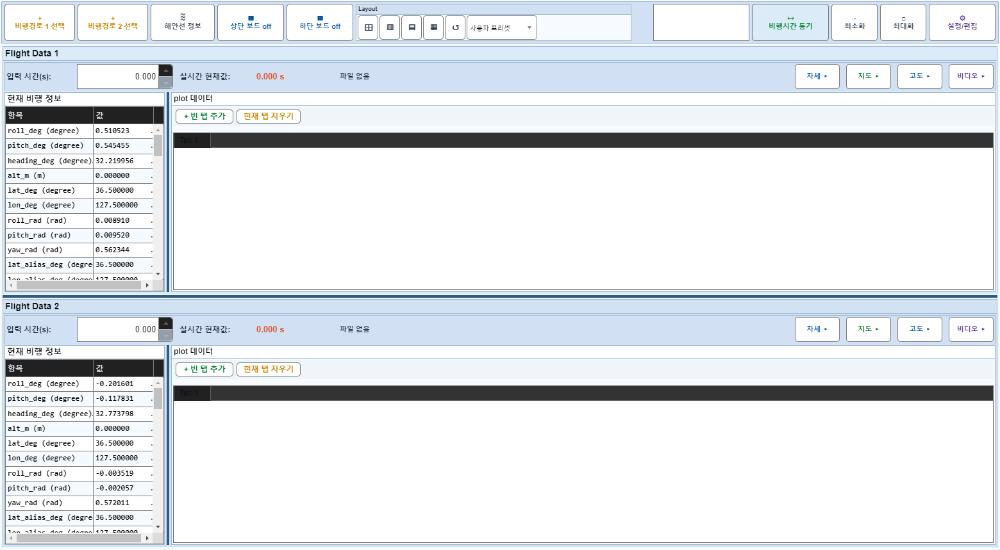
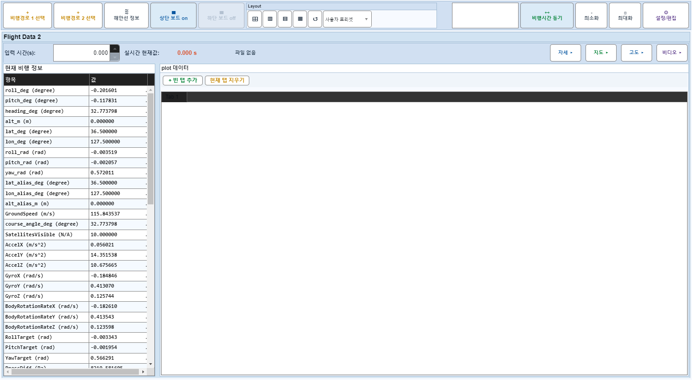

# Case 10: B05 보드1 off + 비디오 off→on 토글 → 보드1 on

- **그룹**: B
- **검증 대상**: 비정상#2 회귀
- **기대 결과**: 보드2 비디오 visible
- **관측 결과**: `PASS`

## 액션 시퀀스

| Step | 액션 | 캡처 |
|------|------|------|
| 01 | baseline (data loaded) |  |
| 02 | 보드1 off |  |
| 03 | 보드2 비디오 off |  |
| 04 | 보드2 비디오 on |  |
| 05 | 보드1 on |  |
