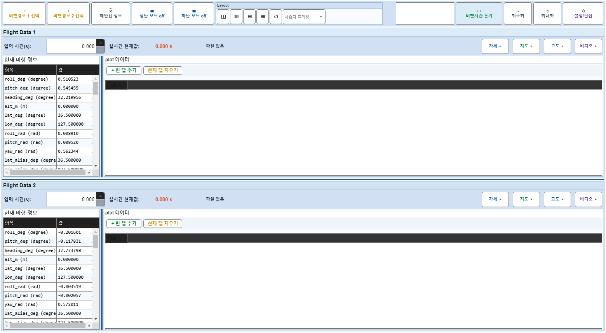
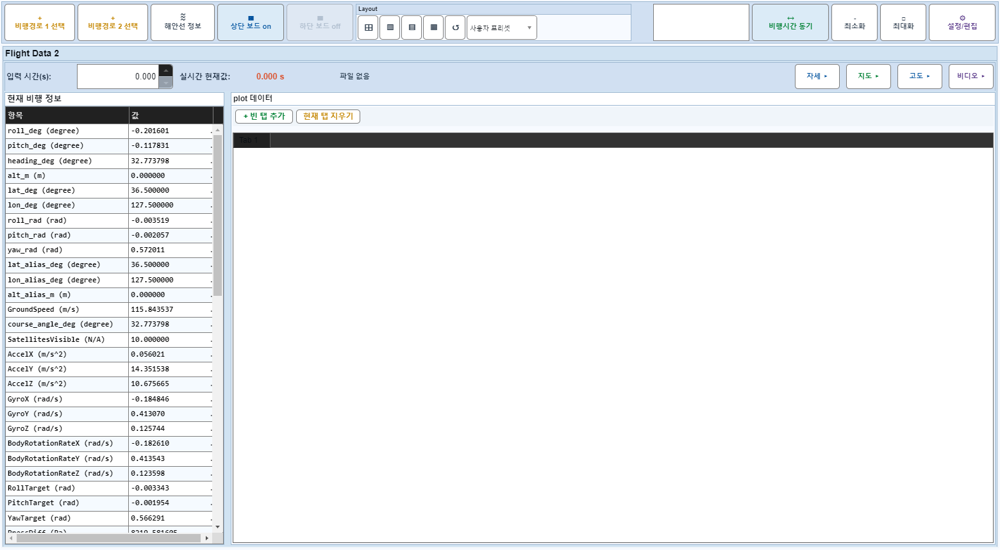

# Case 13: B08 보드1 off + off-summary 현재 탭 지우기

- **그룹**: B
- **기대 결과**: 현재 탭 클리어
- **관측 결과**: `PASS`

## 액션 시퀀스

| Step | 액션 | 캡처 |
|------|------|------|
| 01 | baseline (data loaded) |  |
| 02 | 보드1 off |  |
| 03 | +빈 탭 추가 |  |
| 04 | 현재 탭 지우기 |  |
