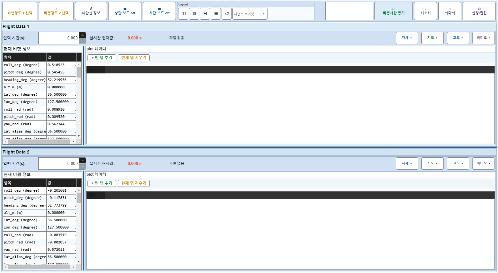
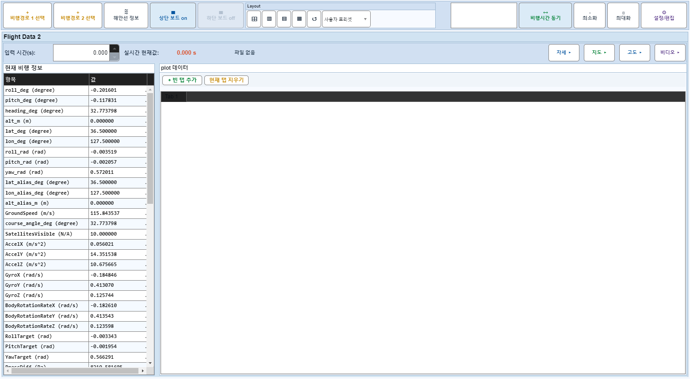
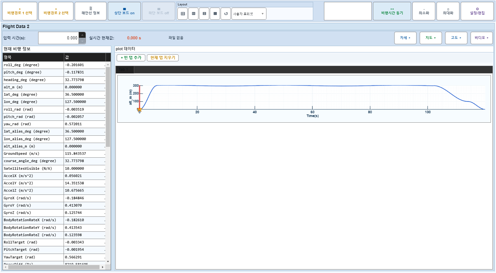
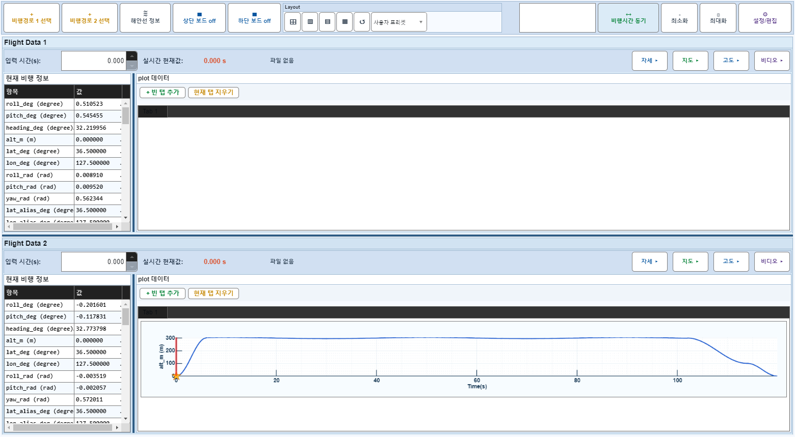

# Case 15: B10 B09 + 보드1 on

- **그룹**: B
- **검증 대상**: 비정상#1 회귀
- **기대 결과**: X축 ≥ 데이터 전체 유지
- **관측 결과**: `PASS`

## 액션 시퀀스

| Step | 액션 | 캡처 |
|------|------|------|
| 01 | baseline (data loaded) |  |
| 02 | 보드1 off |  |
| 03 | off-summary plot 추가 |  |
| 04 | 보드1 on |  |
