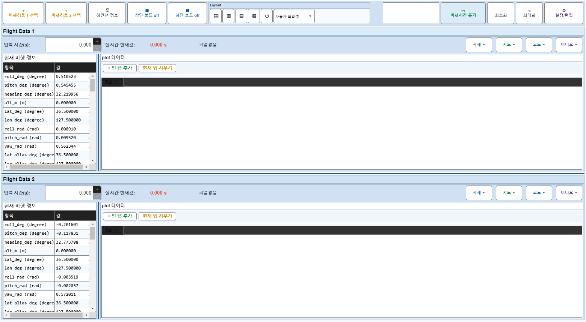
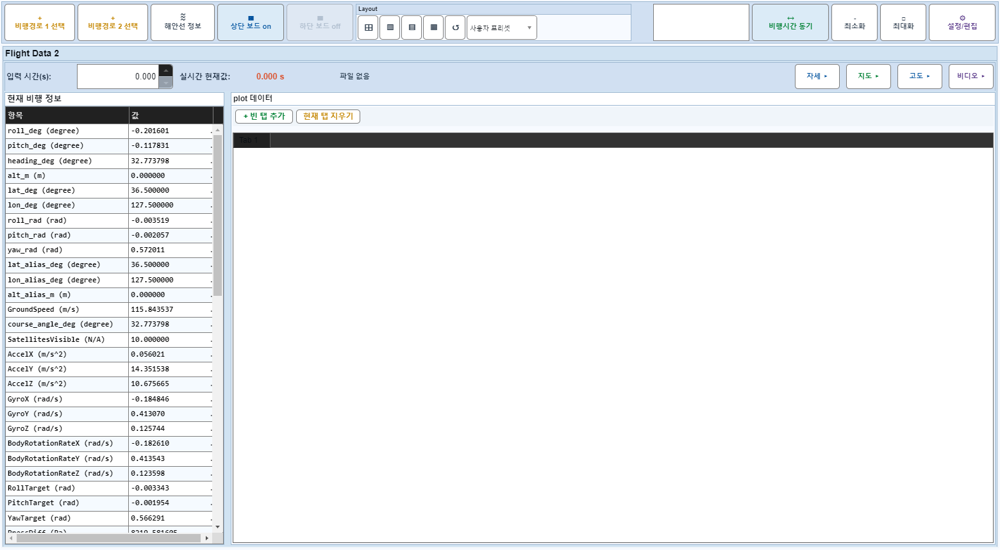
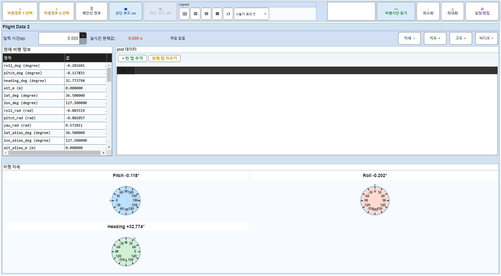
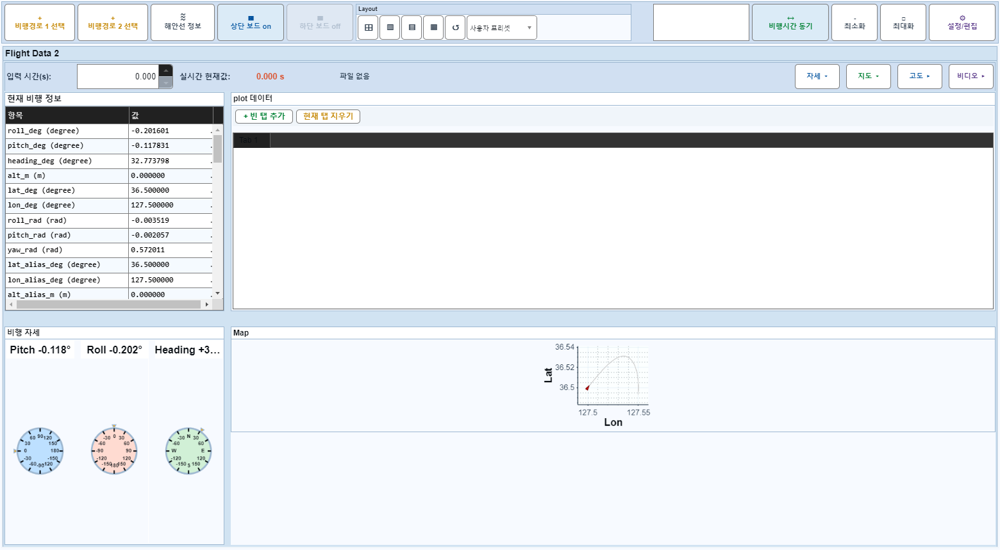
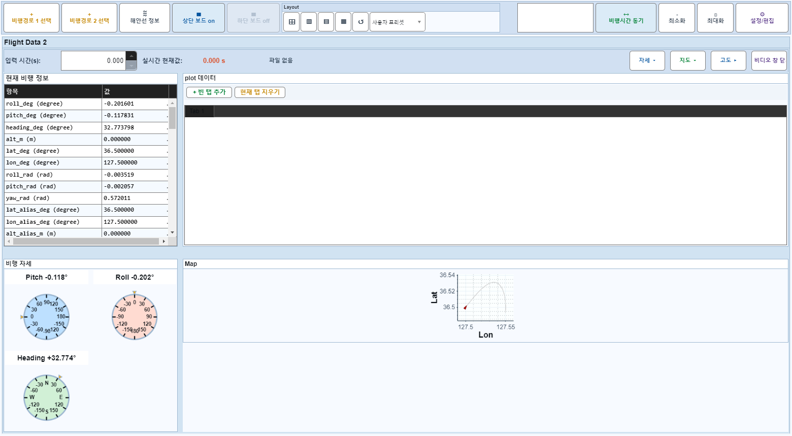

# Case 19: B14 보드1 off + 보드2 3개 모두 off

- **그룹**: B
- **검증 대상**: source 1x flex
- **기대 결과**: widths 폴백 작동
- **관측 결과**: `PASS`

## 액션 시퀀스

| Step | 액션 | 캡처 |
|------|------|------|
| 01 | baseline (data loaded) |  |
| 02 | 보드1 off |  |
| 03 | 자세 off |  |
| 04 | 지도 off |  |
| 05 | 비디오 off |  |
