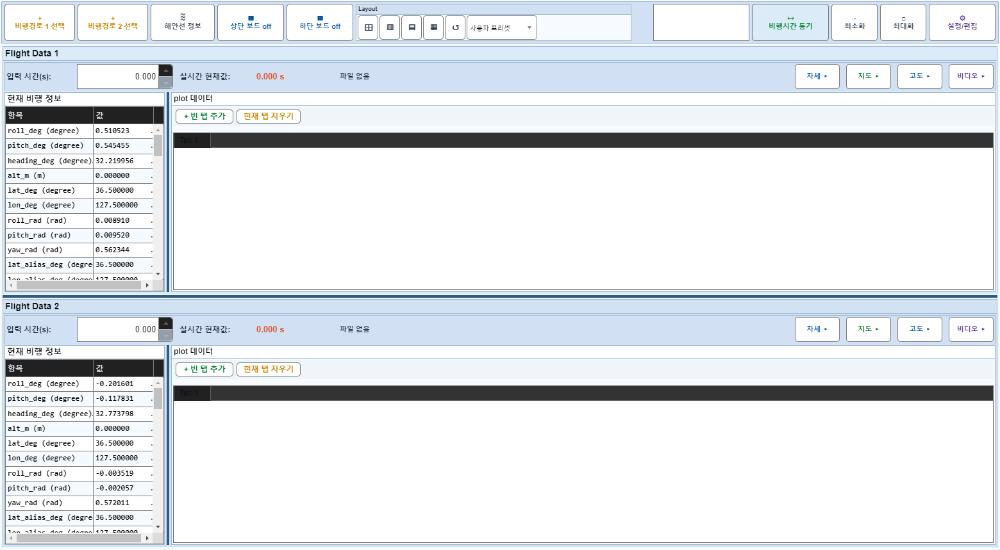
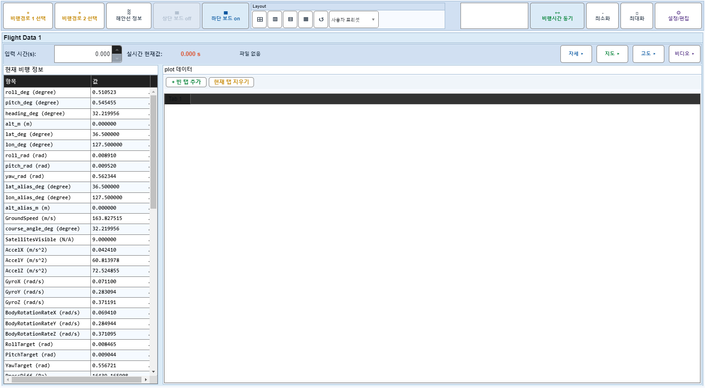
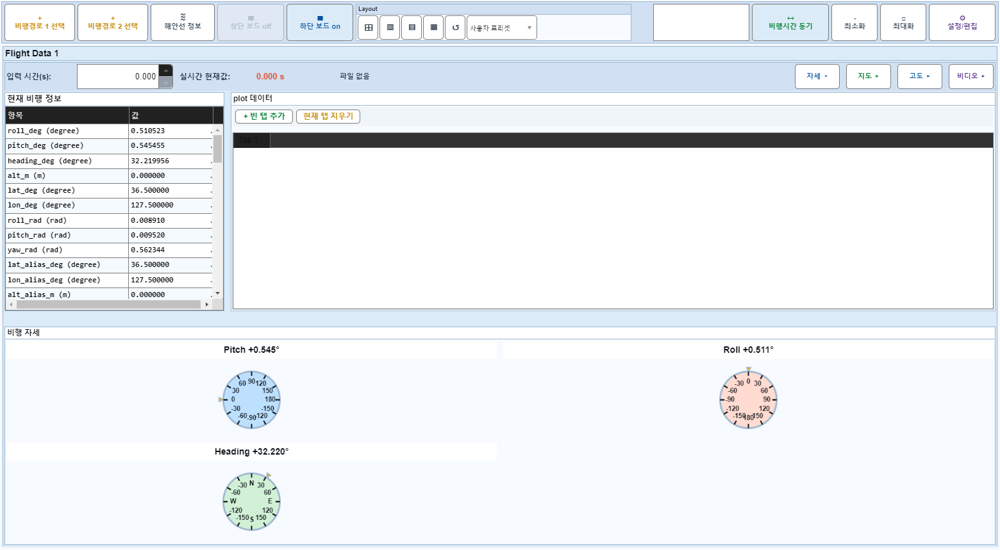
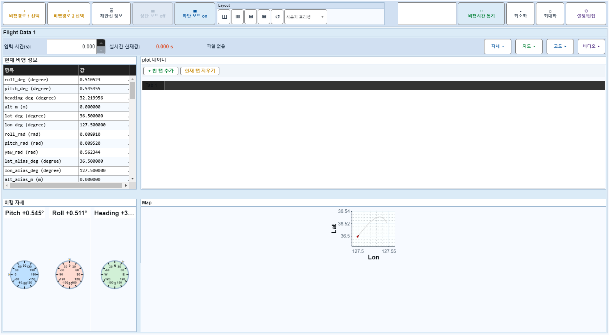
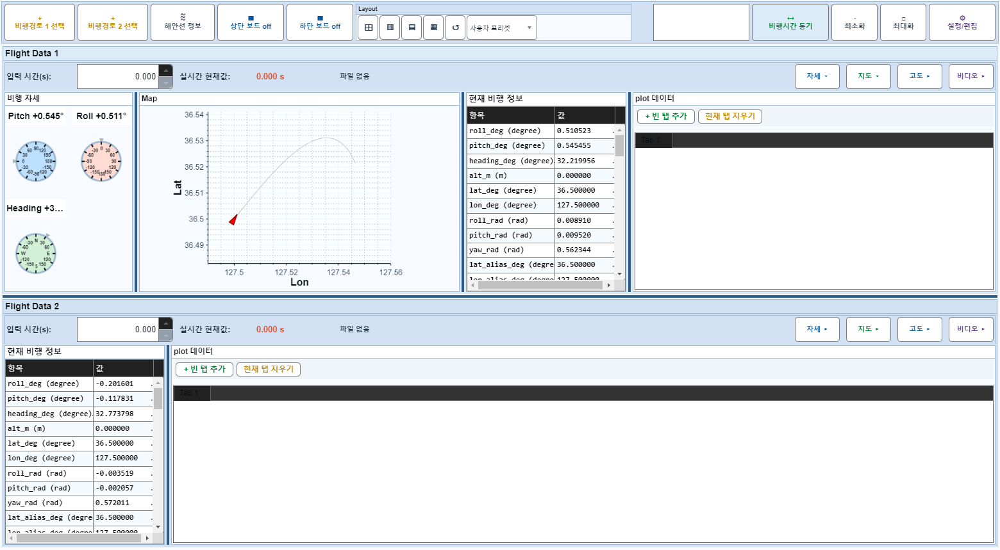

# Case 26: C06 보드2 off + 보드1 자세+지도 off → on

- **그룹**: C
- **기대 결과**: 복합 mid-off
- **관측 결과**: `PASS`

## 액션 시퀀스

| Step | 액션 | 캡처 |
|------|------|------|
| 01 | baseline (data loaded) |  |
| 02 | 보드2 off |  |
| 03 | 자세 off |  |
| 04 | 지도 off |  |
| 05 | 보드2 on |  |
