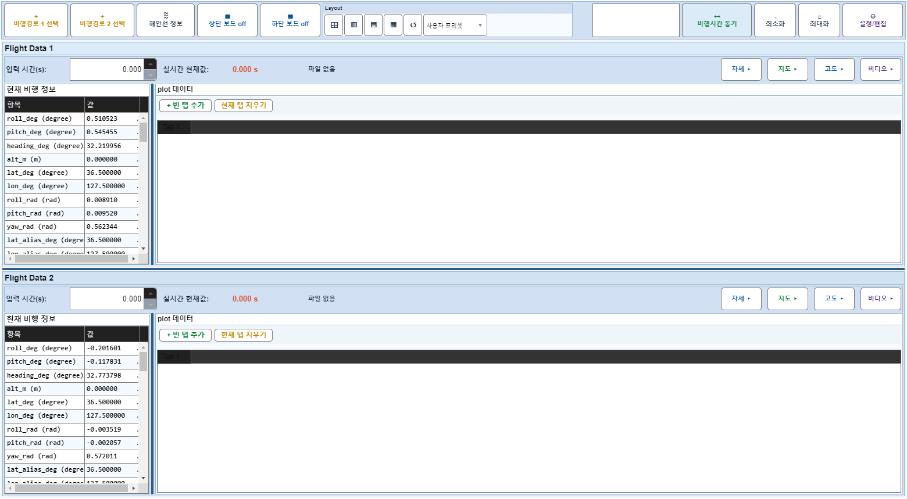
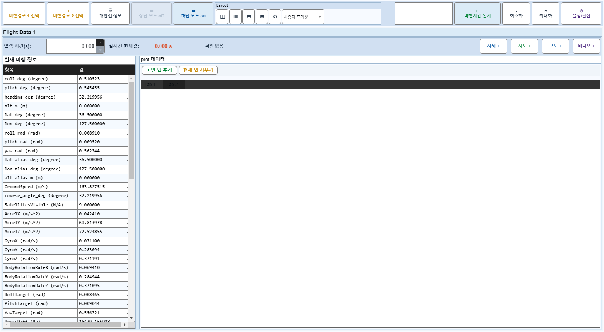

# Case 27: C07 보드2 off + off-summary +빈 탭 추가

- **그룹**: C
- **기대 결과**: 새 탭 추가
- **관측 결과**: `PASS`

## 액션 시퀀스

| Step | 액션 | 캡처 |
|------|------|------|
| 01 | baseline (data loaded) |  |
| 02 | 보드2 off |  |
| 03 | +빈 탭 추가 |  |
