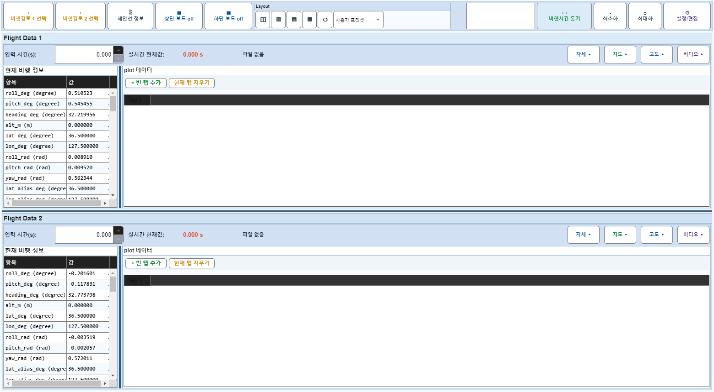
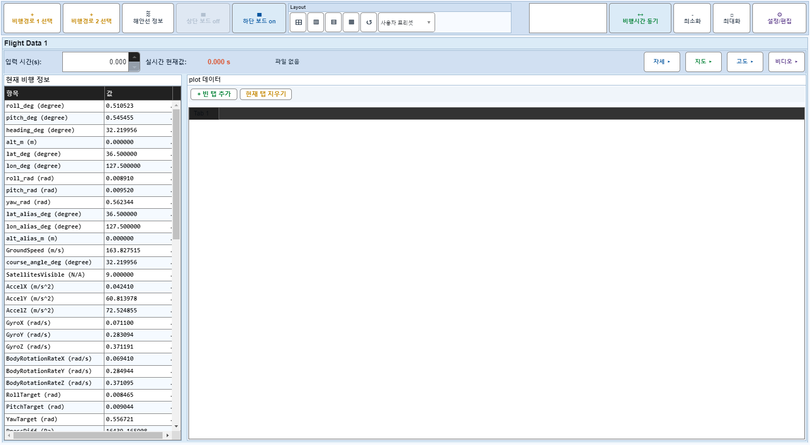
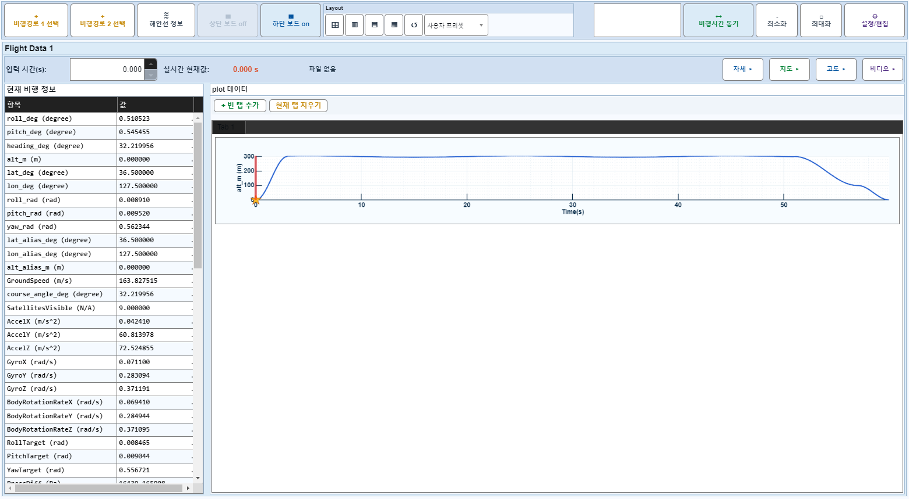

# Case 29: C09 보드2 off + off-summary plot 추가

- **그룹**: C
- **검증 대상**: 비정상#1 회귀
- **기대 결과**: X축 데이터 전체 범위
- **관측 결과**: `PASS`

## 액션 시퀀스

| Step | 액션 | 캡처 |
|------|------|------|
| 01 | baseline (data loaded) |  |
| 02 | 보드2 off |  |
| 03 | off-summary plot 추가 (row=4) |  |
