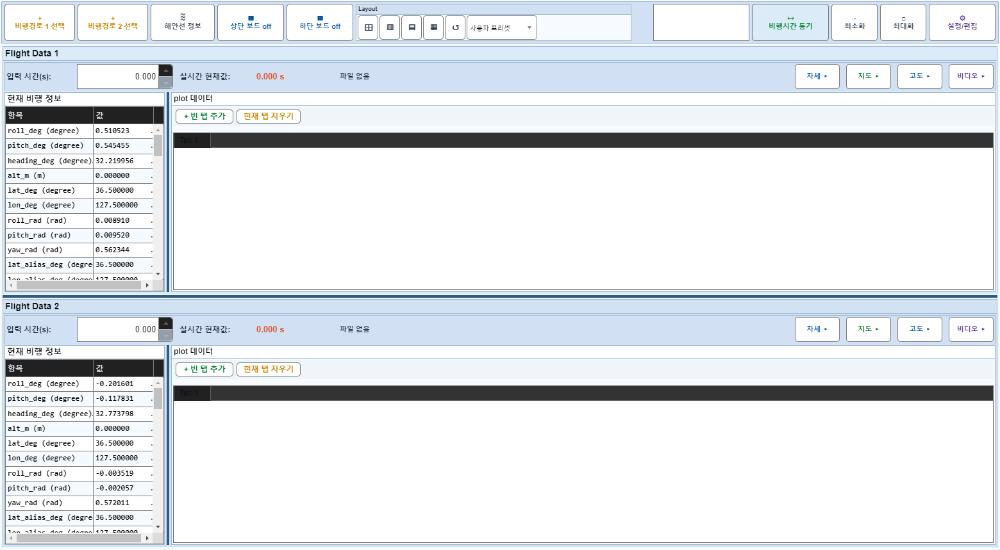
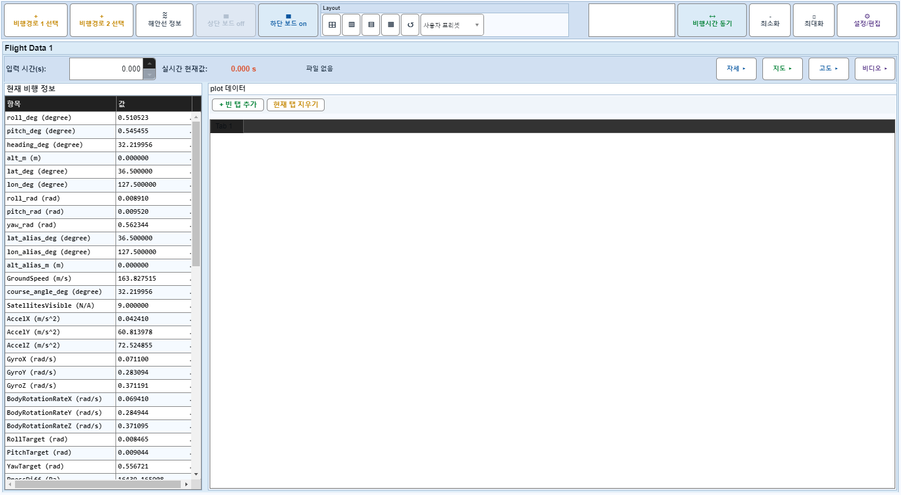
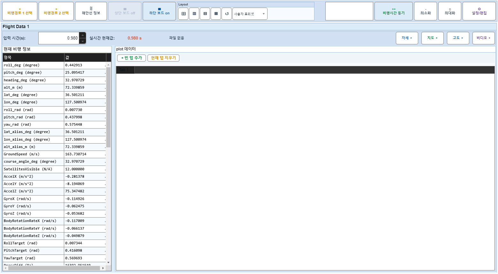
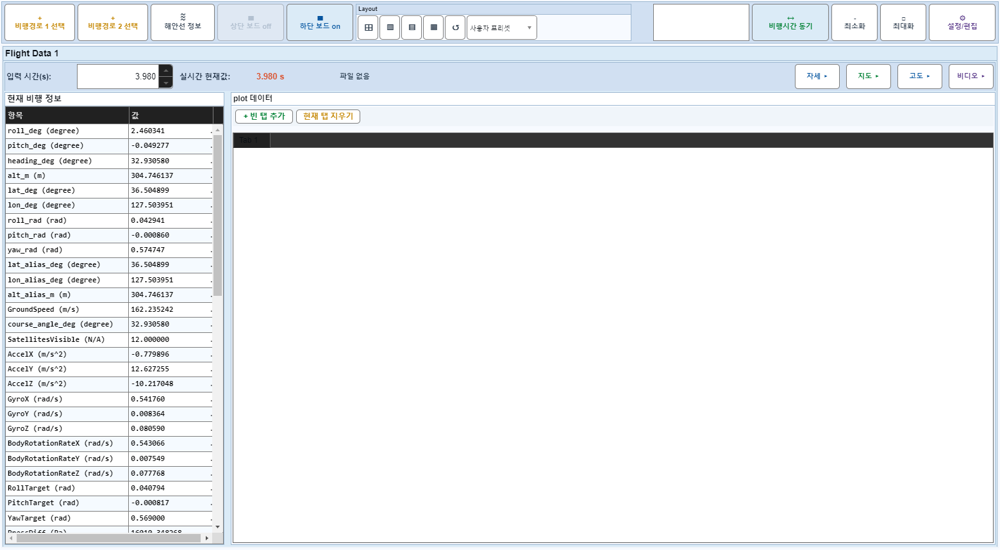

# Case 35: C15 보드2 off + applyTimeChange

- **그룹**: C
- **검증 대상**: 드래그 결과 동기
- **기대 결과**: source 시간 변화
- **관측 결과**: `PASS`

## 액션 시퀀스

| Step | 액션 | 캡처 |
|------|------|------|
| 01 | baseline (data loaded) |  |
| 02 | 보드2 off |  |
| 03 | applyTimeChange(1,50) |  |
| 04 | applyTimeChange(1,200) |  |
