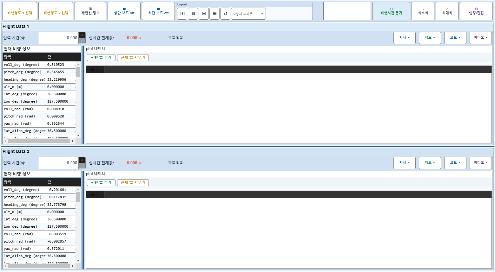
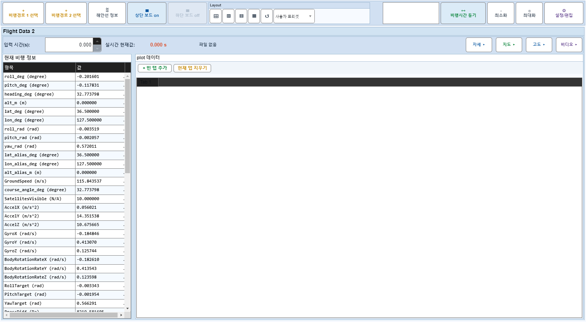

# Case 37: D02 보드1 off 중 보드2 off 호출

- **그룹**: D
- **검증 대상**: mutual exclusion
- **기대 결과**: no-op
- **관측 결과**: `PASS`

## 액션 시퀀스

| Step | 액션 | 캡처 |
|------|------|------|
| 01 | baseline (data loaded) |  |
| 02 | 보드1 off |  |
| 03 | 보드2 off 시도 (무시되어야 함) |  |
