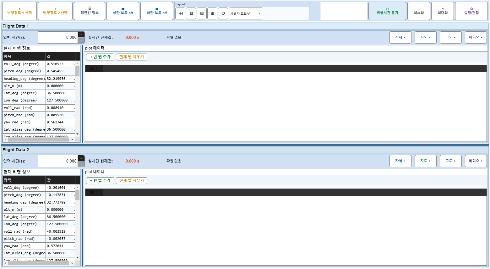
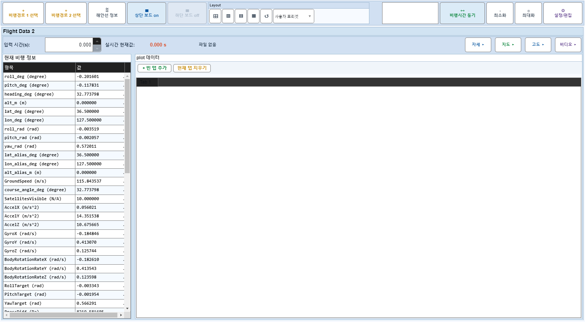
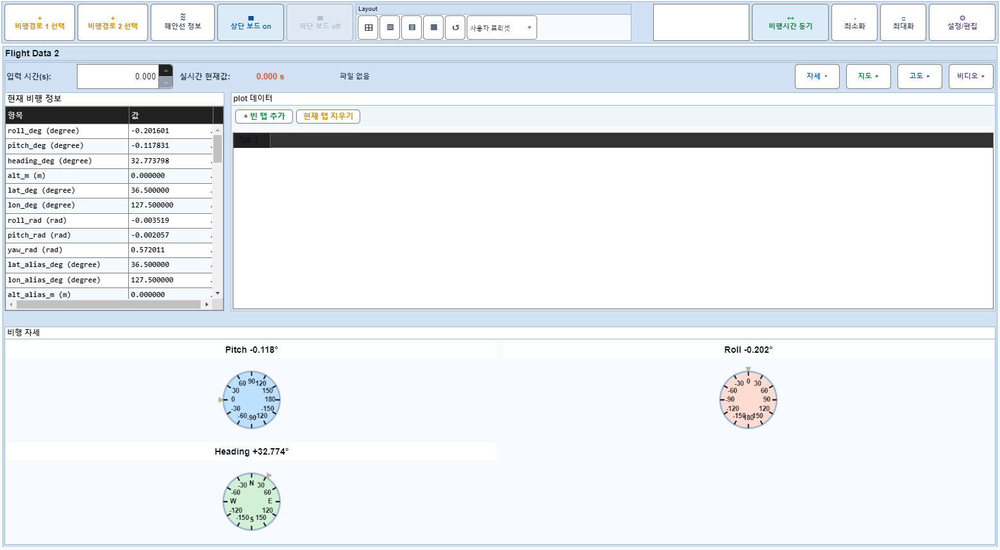
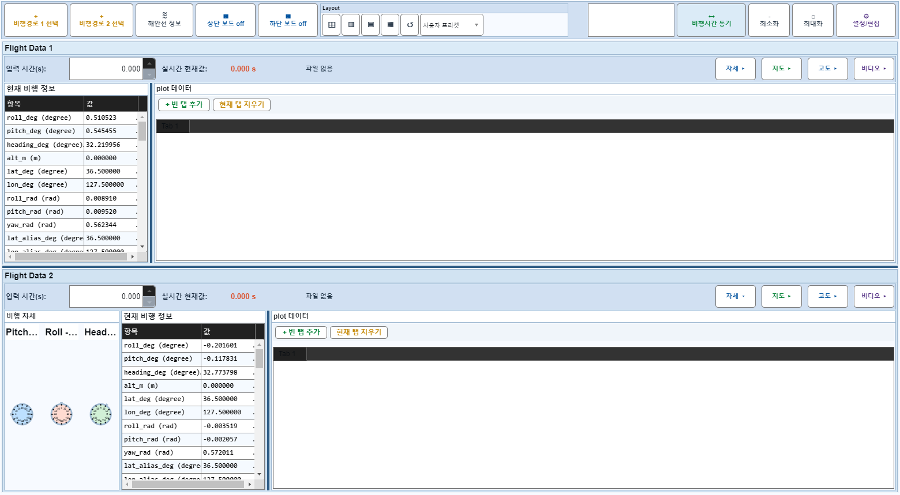

# Case 38: D03 보드1 off + 자세 off → on → 자세 on

- **그룹**: D
- **기대 결과**: 잔여 상태 회귀 없음
- **관측 결과**: `PASS`

## 액션 시퀀스

| Step | 액션 | 캡처 |
|------|------|------|
| 01 | baseline (data loaded) |  |
| 02 | 보드1 off |  |
| 03 | 자세 off |  |
| 04 | 보드1 on |  |
| 05 | 자세 on |  |
