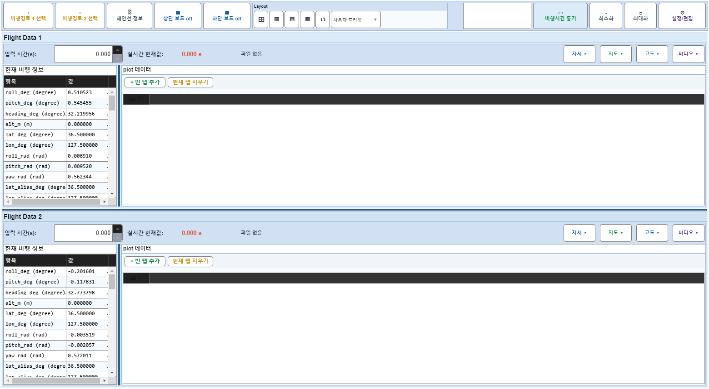
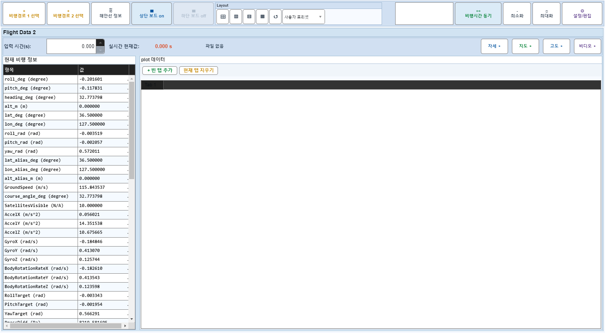
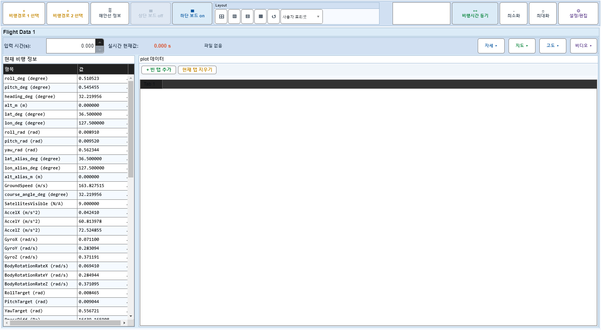

# Case 39: D04 복합 전이

- **그룹**: D
- **기대 결과**: 전체 시퀀스 회귀
- **관측 결과**: `PASS`

## 액션 시퀀스

| Step | 액션 | 캡처 |
|------|------|------|
| 01 | baseline (data loaded) |  |
| 02 | 보드1 off |  |
| 03 | 비디오 off |  |
| 04 | 보드1 on |  |
| 05 | 보드2 off |  |
| 06 | 보드1 비디오 off |  |
| 07 | 보드1 비디오 on |  |
| 08 | 보드2 on |  |
