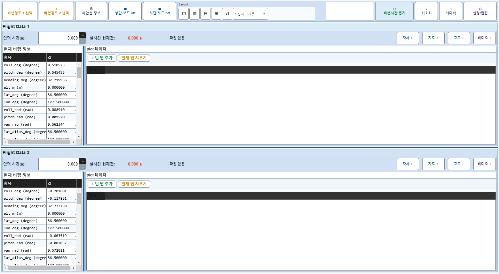
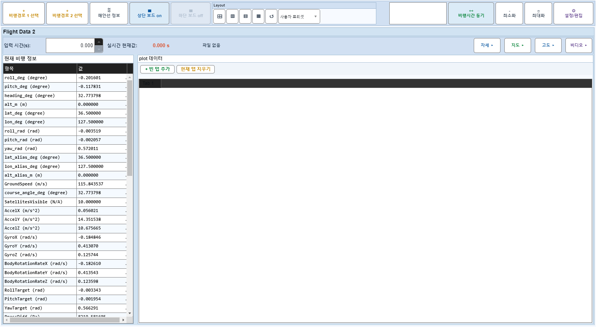

# Case 40: D05 빠른 보드1 off/on 5회

- **그룹**: D
- **검증 대상**: timer/drawnow 회귀
- **기대 결과**: 크래시 없음
- **관측 결과**: `PASS`

## 액션 시퀀스

| Step | 액션 | 캡처 |
|------|------|------|
| 01 | baseline (data loaded) |  |
| 02 | off1 |  |
| 03 | on1 |  |
| 04 | off2 |  |
| 05 | on2 |  |
| 06 | off3 |  |
| 07 | on3 |  |
| 08 | off4 |  |
| 09 | on4 |  |
| 10 | off5 |  |
| 11 | on5 |  |
