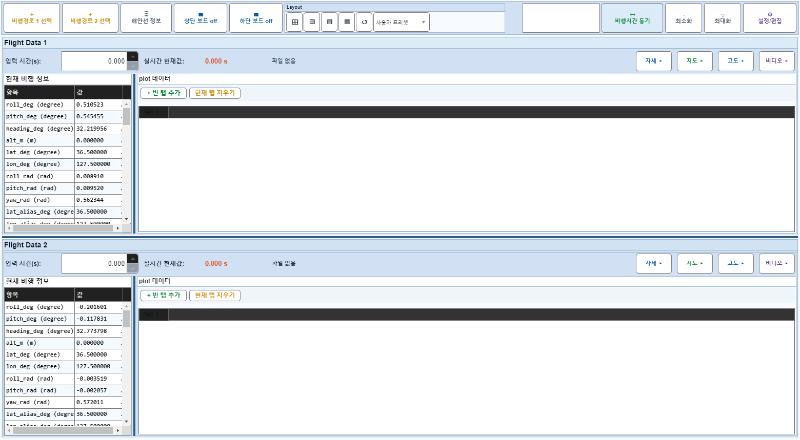
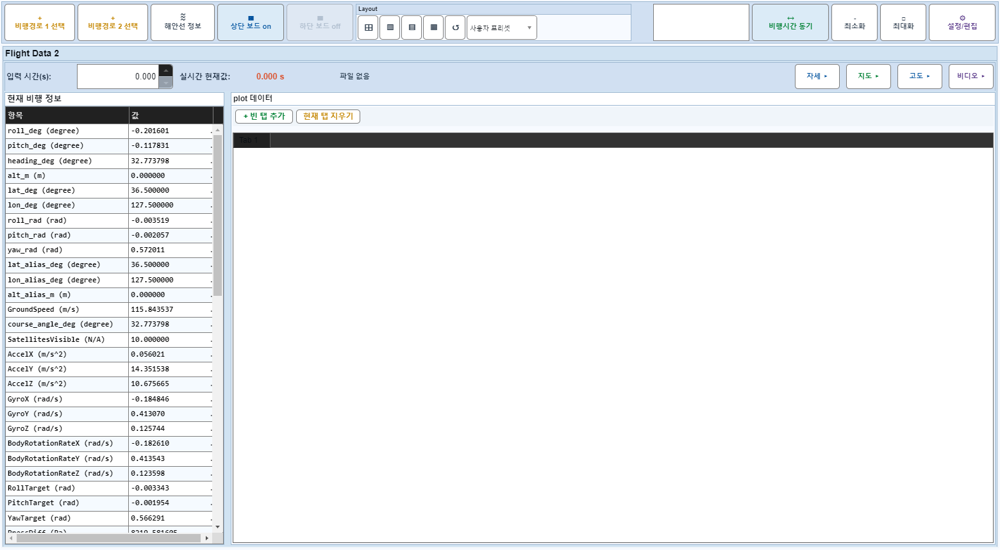

# Case 41: D06 보드1 off 중 보드1 자세 off 시도

- **그룹**: D
- **기대 결과**: hidden 이므로 무영향
- **관측 결과**: `PASS`

## 액션 시퀀스

| Step | 액션 | 캡처 |
|------|------|------|
| 01 | baseline (data loaded) |  |
| 02 | 보드1 off |  |
| 03 | 보드1 자세 off (off 상태) |  |
