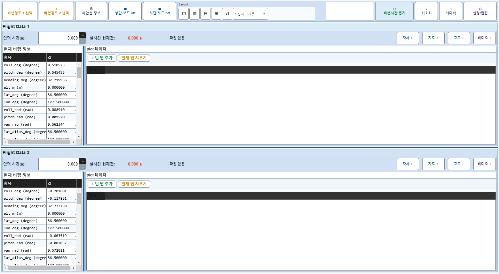
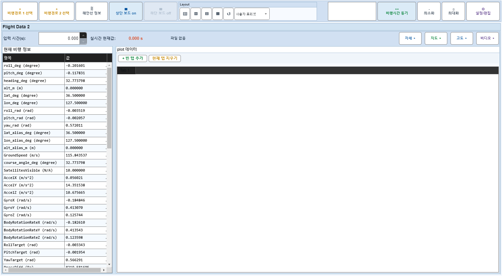
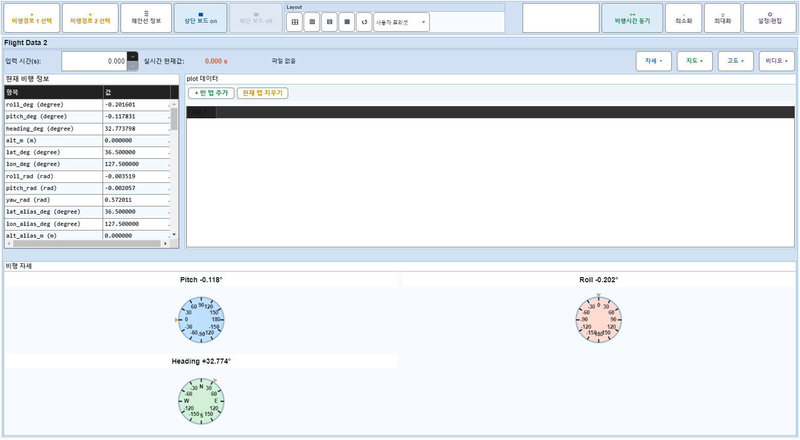
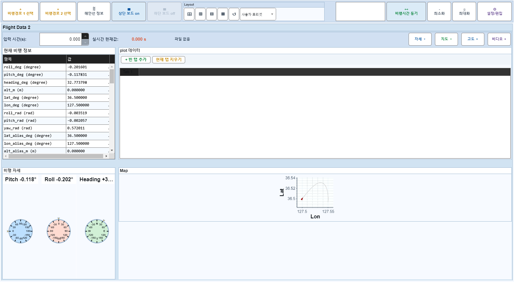

# Case 43: D08 보드1 off + source 2단계 hide

- **그룹**: D
- **기대 결과**: 폭 흡수
- **관측 결과**: `PASS`

## 액션 시퀀스

| Step | 액션 | 캡처 |
|------|------|------|
| 01 | baseline (data loaded) |  |
| 02 | 보드1 off |  |
| 03 | 자세 off |  |
| 04 | 지도 off |  |
