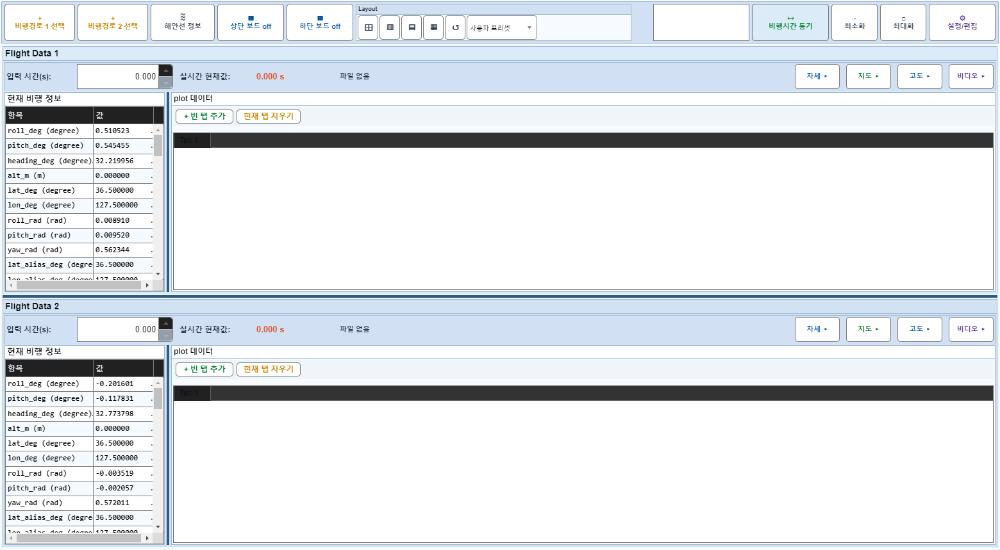
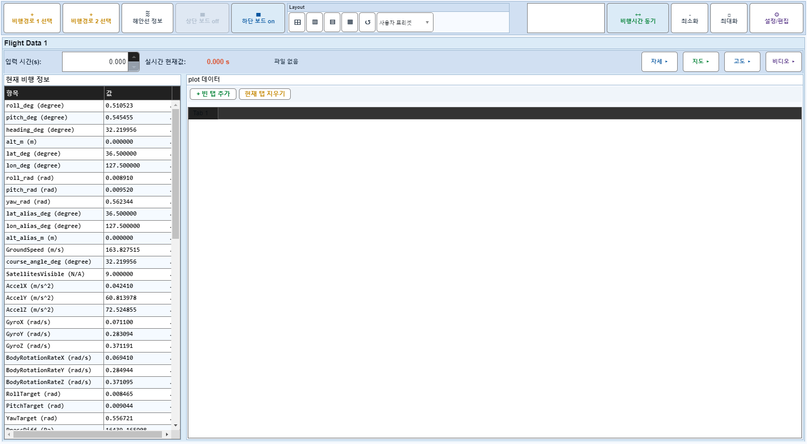

# Case 44: D09 보드2 off + 보드1 비디오 on→off→on

- **그룹**: D
- **검증 대상**: 반대 보드 회귀
- **기대 결과**: 마지막 on 유지
- **관측 결과**: `PASS`

## 액션 시퀀스

| Step | 액션 | 캡처 |
|------|------|------|
| 01 | baseline (data loaded) |  |
| 02 | 보드2 off |  |
| 03 | 비디오 off |  |
| 04 | 비디오 on |  |
