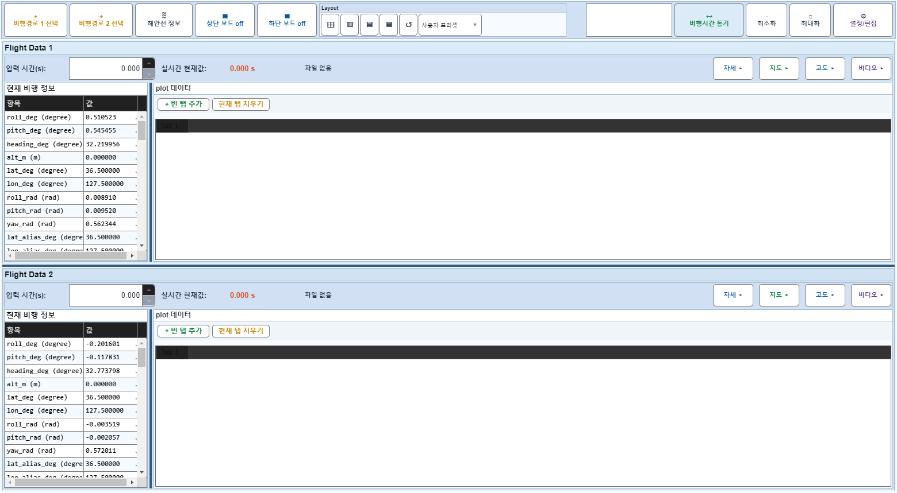
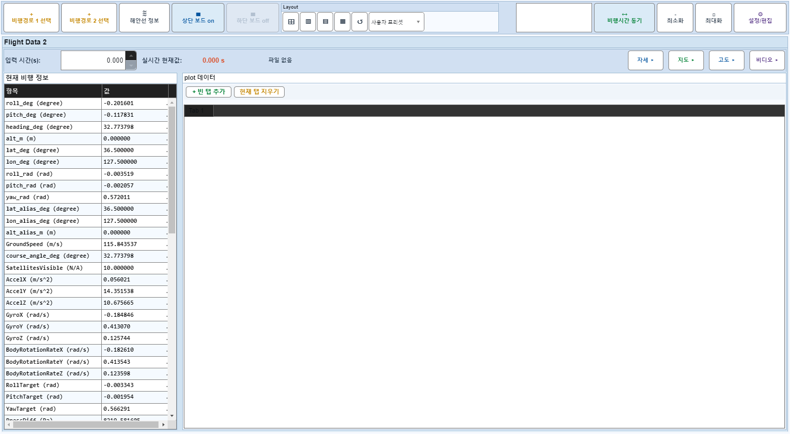

# Case 45: D10 보드1 off 후 off-summary 버튼 가시성

- **그룹**: D
- **검증 대상**: 4014bf9 회귀
- **기대 결과**: +빈 탭 추가 보임
- **관측 결과**: `PASS`

## 액션 시퀀스

| Step | 액션 | 캡처 |
|------|------|------|
| 01 | baseline (data loaded) |  |
| 02 | 보드1 off |  |
| 03 | +빈 탭 추가 (보여야 함) |  |
