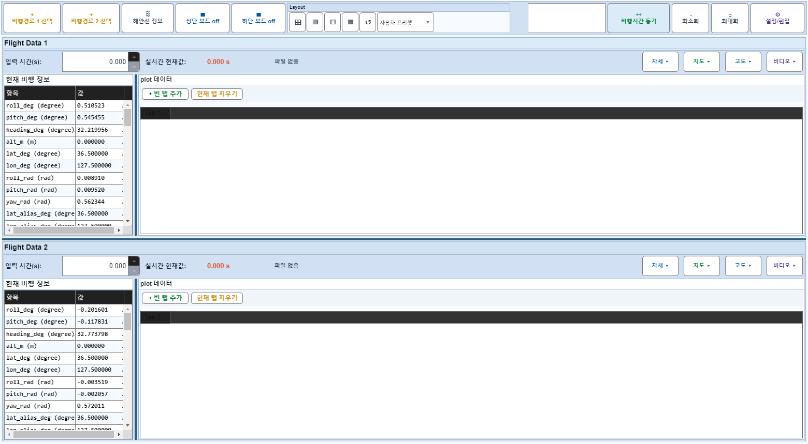
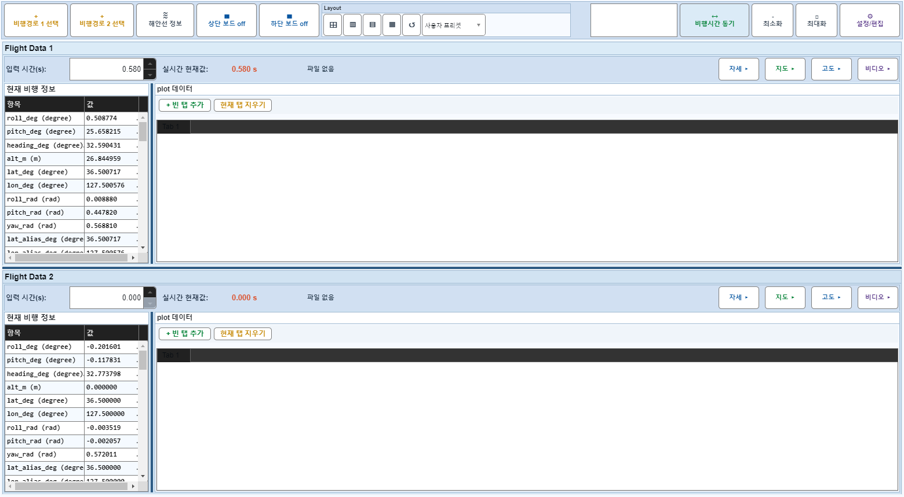

# Case 46: E01 일반 모드 보드1 시간 변화

- **그룹**: E
- **검증 대상**: 별표 드래그 결과
- **기대 결과**: marker/spinner 동기
- **관측 결과**: `PASS`

## 액션 시퀀스

| Step | 액션 | 캡처 |
|------|------|------|
| 01 | baseline (data loaded) |  |
| 02 | applyTimeChange(1,30) |  |
| 03 | applyTimeChange(1,100) |  |
