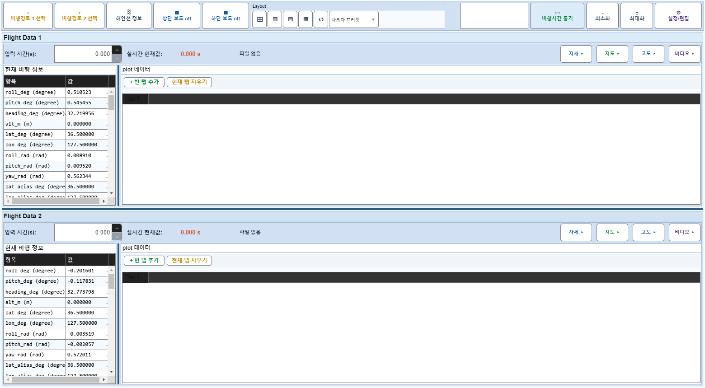
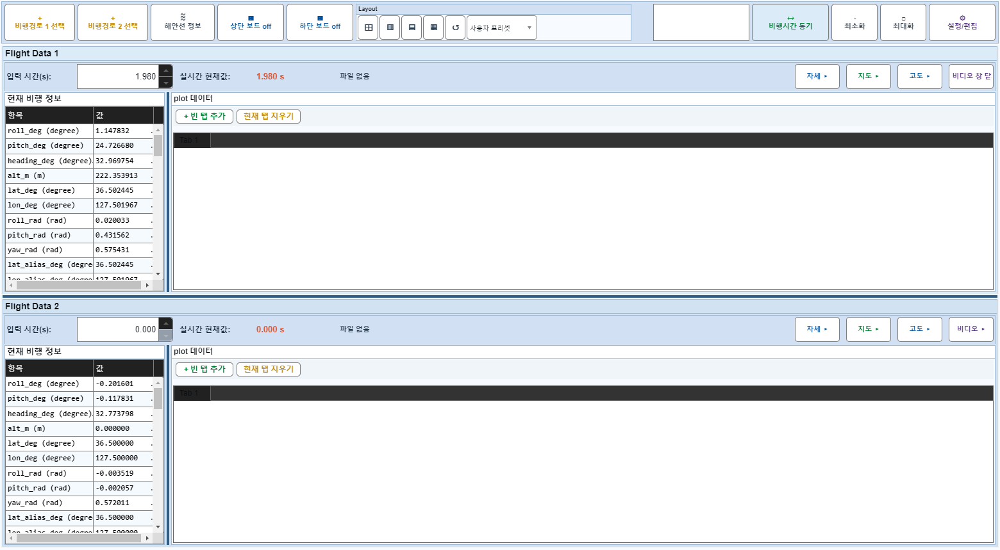

# Case 50: E05 보드1 비디오 off + applyTimeChange

- **그룹**: E
- **검증 대상**: 비디오 hidden 회귀
- **기대 결과**: 크래시 없음
- **관측 결과**: `PASS`

## 액션 시퀀스

| Step | 액션 | 캡처 |
|------|------|------|
| 01 | baseline (data loaded) |  |
| 02 | 보드1 비디오 off |  |
| 03 | applyTimeChange(1,100) |  |
