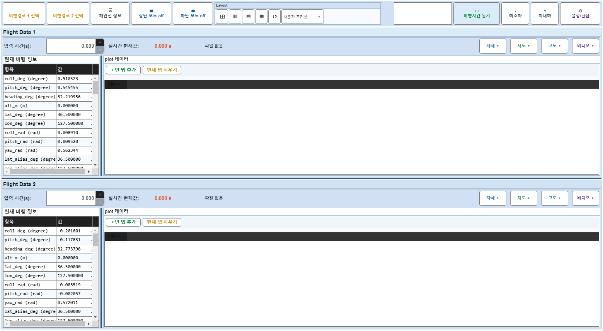
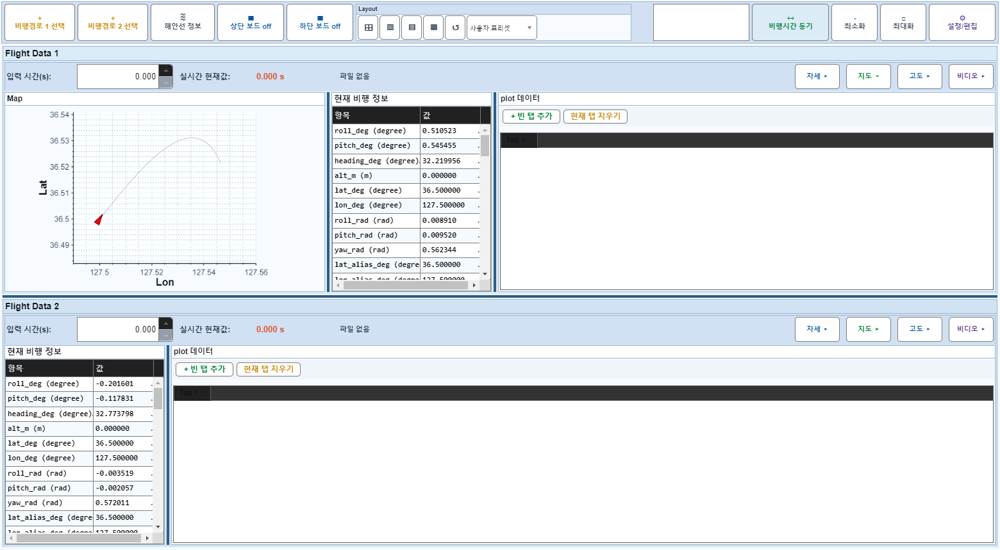
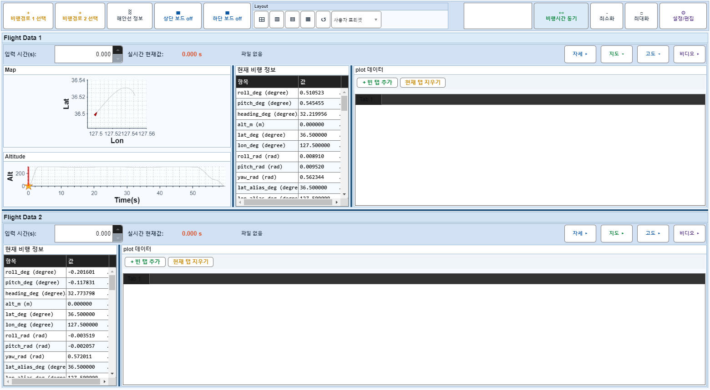
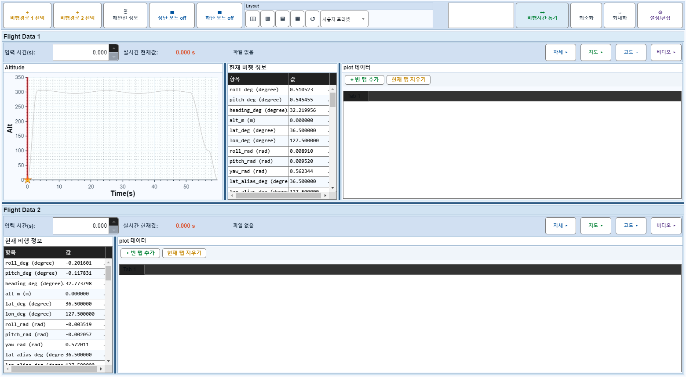

# Case 51: G-LAYOUT-01 map/altitude independent toggle

- **그룹**: G-LAYOUT
- **검증 대상**: mapOnly/altOnly
- **기대 결과**: independent PanelVisible and width state
- **관측 결과**: `PASS`

## 액션 시퀀스

| Step | 액션 | 캡처 |
|------|------|------|
| 01 | baseline (data loaded) |  |
| 02 | Flight 1 mapOnly toggle |  |
| 03 | Flight 1 altOnly toggle |  |
| 04 | Flight 1 mapOnly restore |  |
