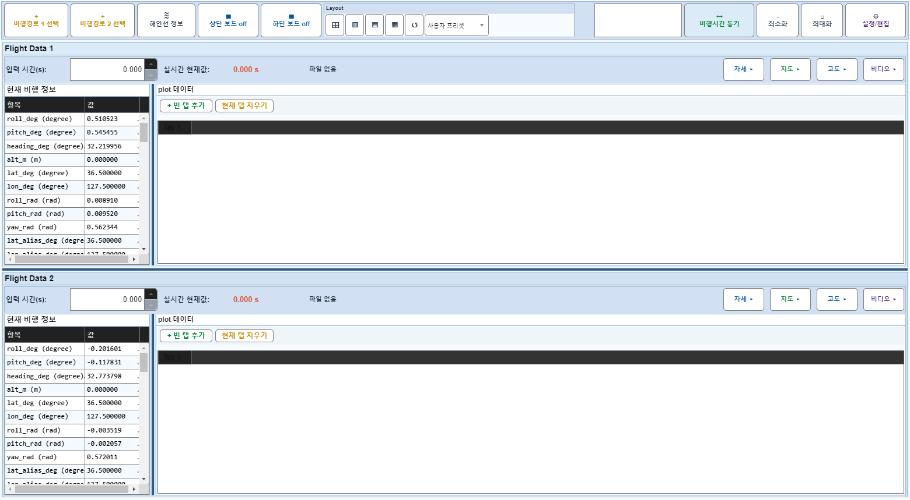
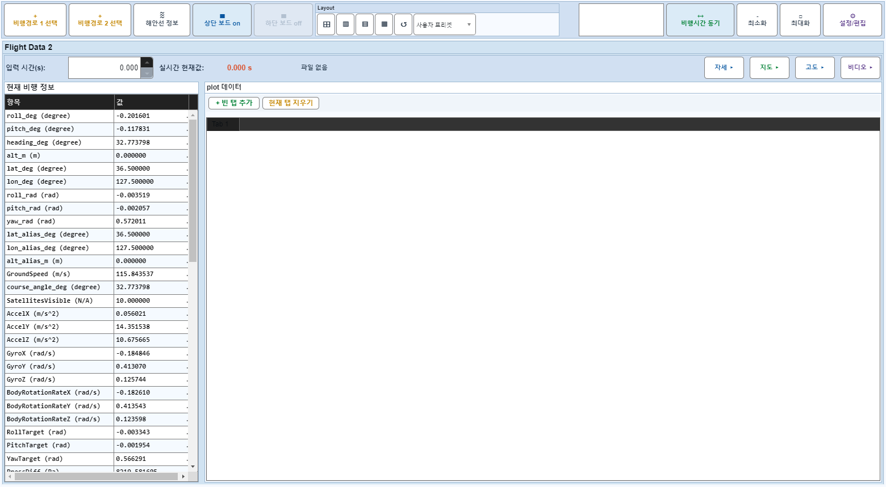
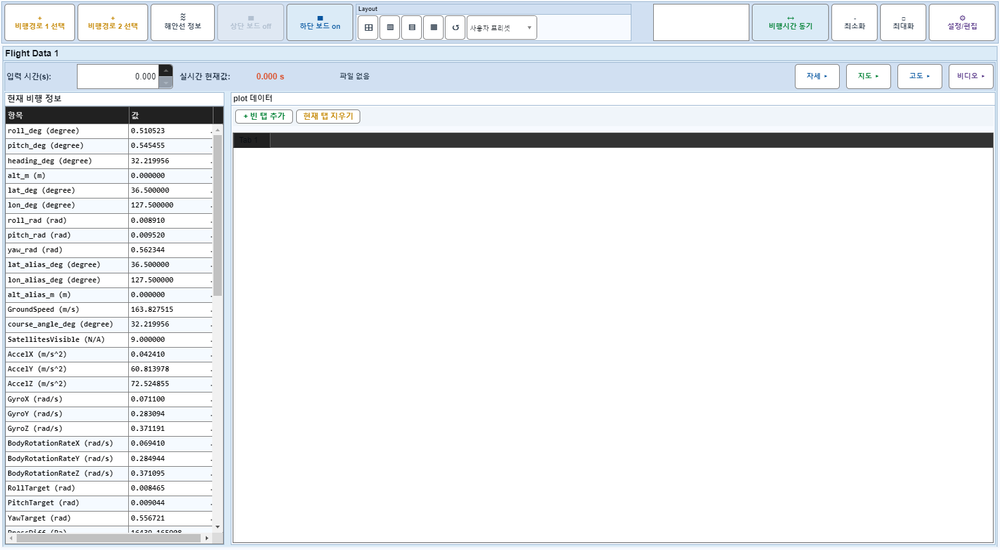

# Case 52: G-LAYOUT-02 board-off active board expansion

- **그룹**: G-LAYOUT
- **검증 대상**: BodyGrid row splitter
- **기대 결과**: source board expands, splitter hides
- **관측 결과**: `PASS`

## 액션 시퀀스

| Step | 액션 | 캡처 |
|------|------|------|
| 01 | baseline (data loaded) |  |
| 02 | upper board off |  |
| 03 | upper board on |  |
| 04 | lower board off |  |
| 05 | lower board on |  |
