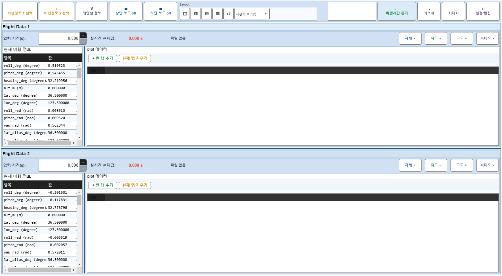
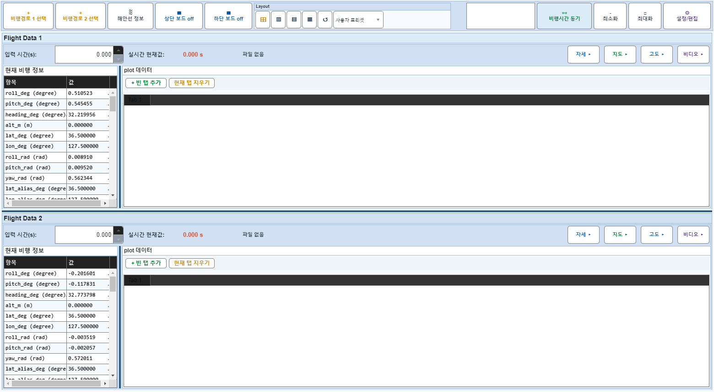

# Case 53: G-LAYOUT-03 layout-grid arrangement only

- **그룹**: G-LAYOUT
- **검증 대상**: layout-grid
- **기대 결과**: arrangement preset preserves PanelVisible
- **관측 결과**: `PASS`

## 액션 시퀀스

| Step | 액션 | 캡처 |
|------|------|------|
| 01 | baseline (data loaded) |  |
| 02 | apply layout-grid preset |  |
