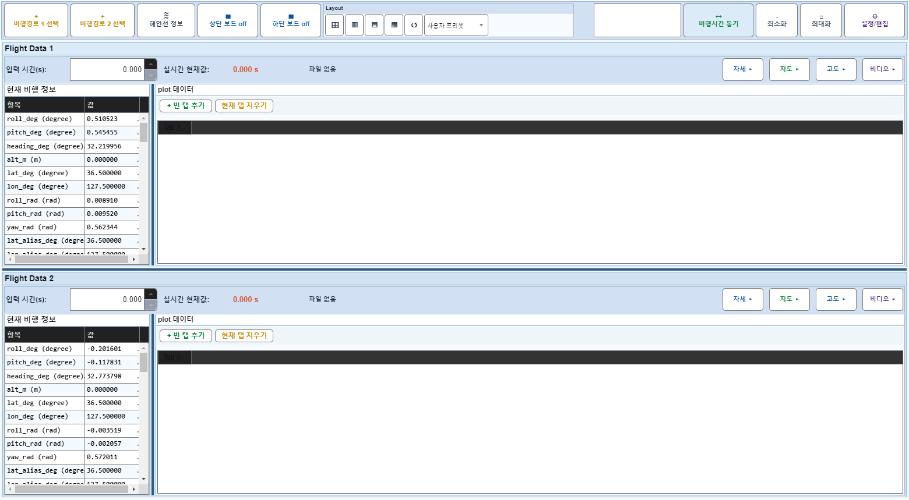
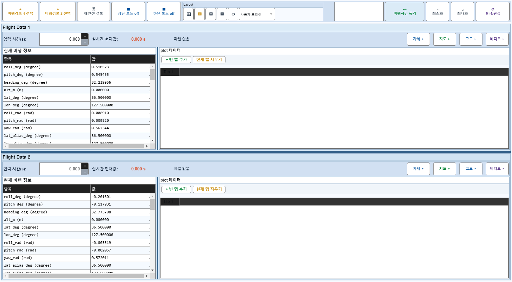
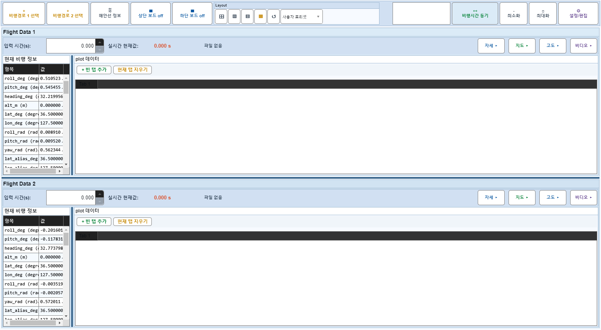

# Case 54: G-LAYOUT-04 layout-vsplit + layout-compact built-in

- **그룹**: G-LAYOUT
- **검증 대상**: built-in presets
- **기대 결과**: two arrangement presets apply cleanly
- **관측 결과**: `PASS`

## 액션 시퀀스

| Step | 액션 | 캡처 |
|------|------|------|
| 01 | baseline (data loaded) |  |
| 02 | apply layout-vsplit preset |  |
| 03 | apply layout-compact preset |  |
