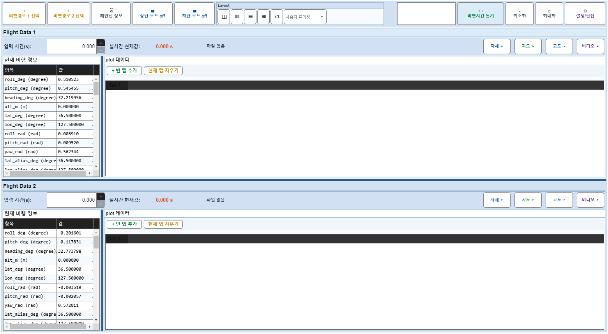
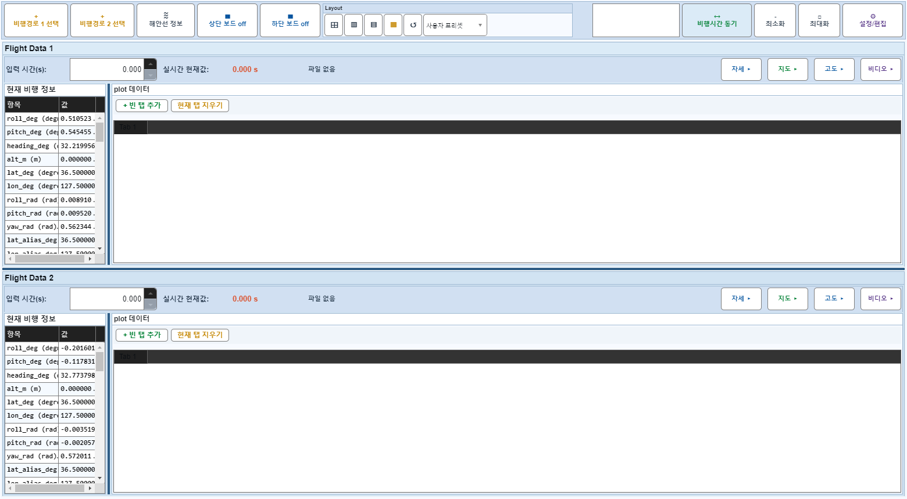
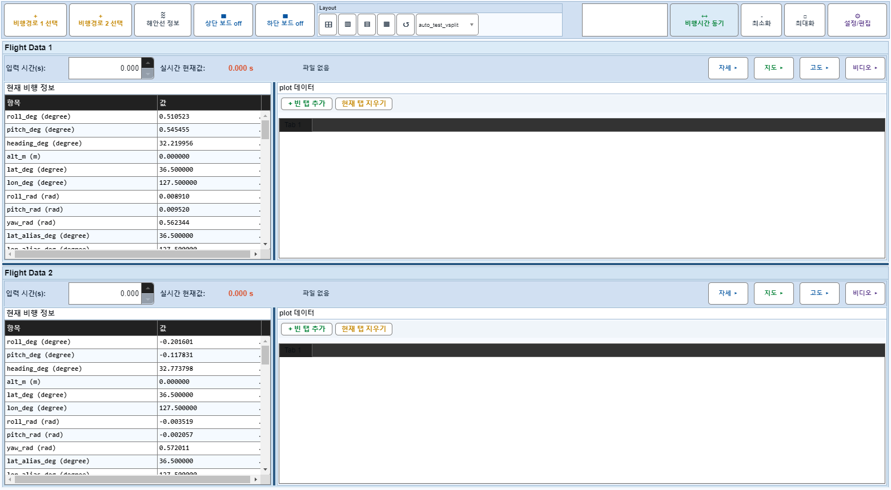

# Case 55: G-LAYOUT-05 custom preset save/apply/delete

- **그룹**: G-LAYOUT
- **검증 대상**: custom presets
- **기대 결과**: arrangement preset save/apply/delete plumbing
- **관측 결과**: `PASS`

## 액션 시퀀스

| Step | 액션 | 캡처 |
|------|------|------|
| 01 | baseline (data loaded) |  |
| 02 | apply layout-vsplit before save |  |
| 03 | save custom preset |  |
| 04 | change arrangement after save |  |
| 05 | apply saved custom preset |  |
| 06 | delete saved custom preset |  |
