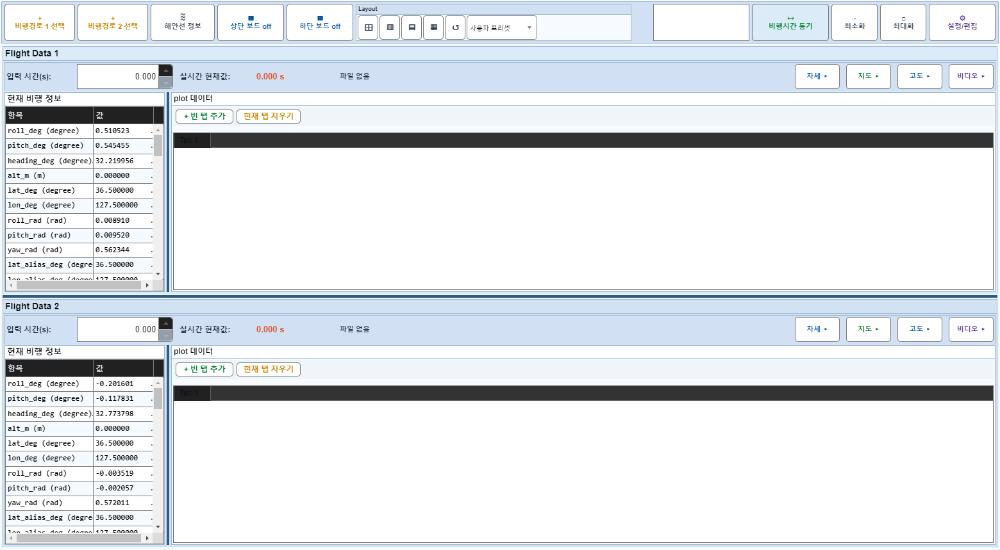
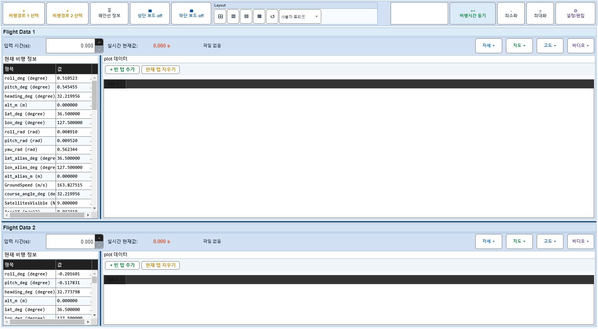

# Case 57: G-LAYOUT-07 row splitter drag state

- **그룹**: G-LAYOUT
- **검증 대상**: row splitter
- **기대 결과**: row split ratio changes deterministically
- **관측 결과**: `PASS`

## 액션 시퀀스

| Step | 액션 | 캡처 |
|------|------|------|
| 01 | baseline (data loaded) |  |
| 02 | set row split ratio to 0.65 |  |
