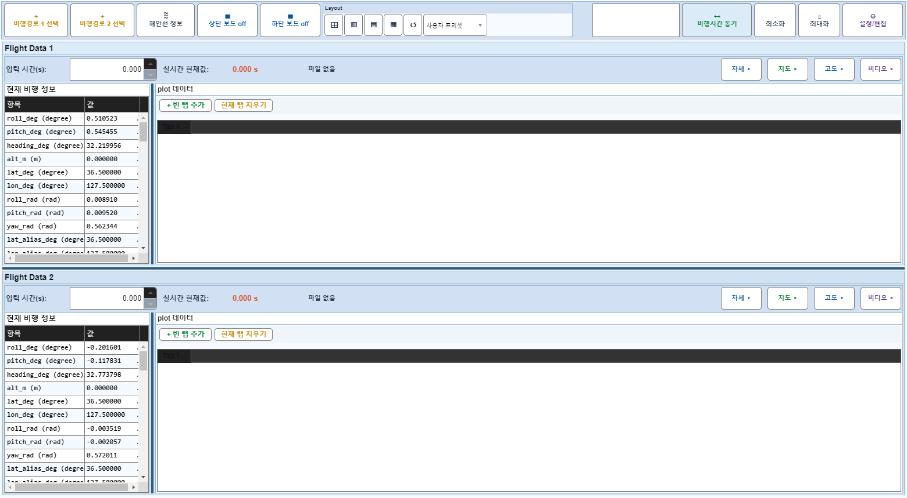
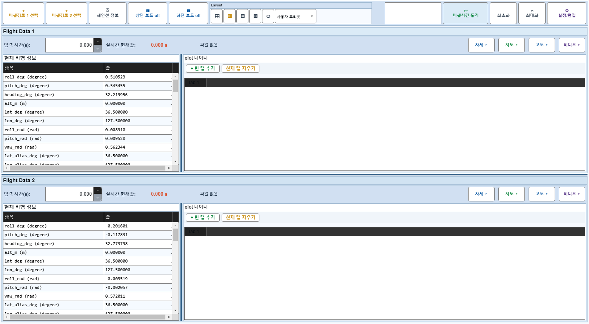
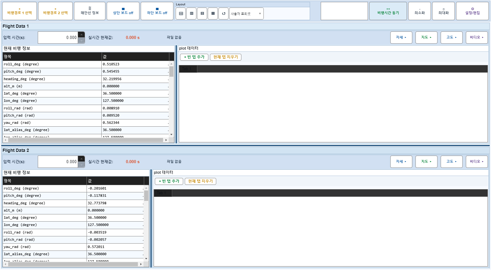

# Case 58: G-LAYOUT-08 column splitter drag state

- **그룹**: G-LAYOUT
- **검증 대상**: column splitter
- **기대 결과**: ColumnWidth changes deterministically, plot=1x preserved
- **관측 결과**: `PASS`

## 액션 시퀀스

| Step | 액션 | 캡처 |
|------|------|------|
| 01 | baseline (data loaded) |  |
| 02 | show info/plot columns |  |
| 03 | drag Flight 1 info/plot splitter |  |
