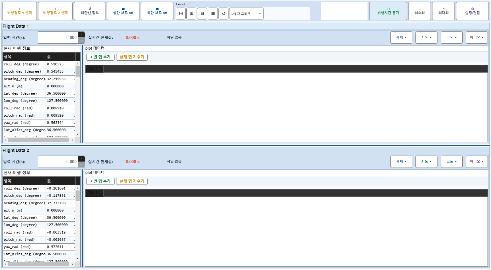
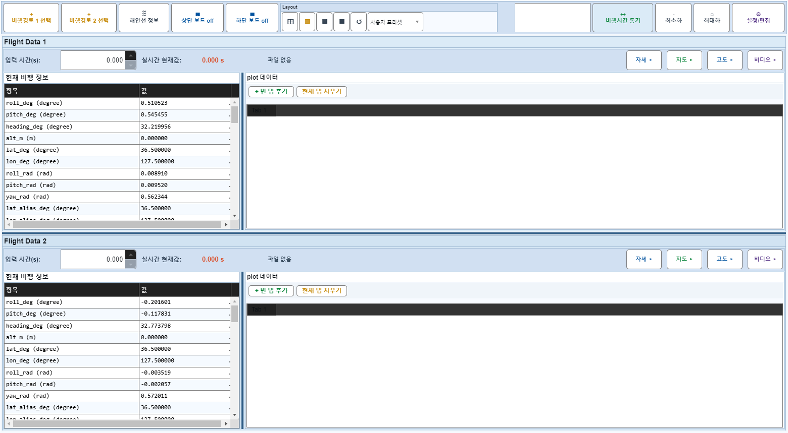
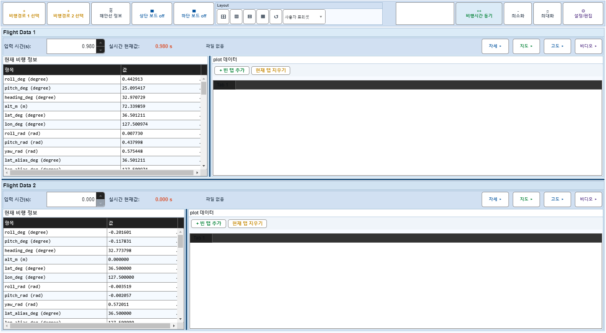

# Case 59: G-LAYOUT-09 marker drag still works after splitter drag

- **그룹**: G-LAYOUT
- **검증 대상**: drag conflict guard
- **기대 결과**: marker/time update survives splitter change
- **관측 결과**: `PASS`

## 액션 시퀀스

| Step | 액션 | 캡처 |
|------|------|------|
| 01 | baseline (data loaded) |  |
| 02 | show info/plot columns |  |
| 03 | drag Flight 1 info/plot splitter |  |
| 04 | applyTimeChange(1,50) |  |
