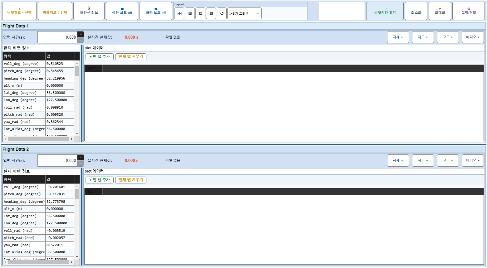
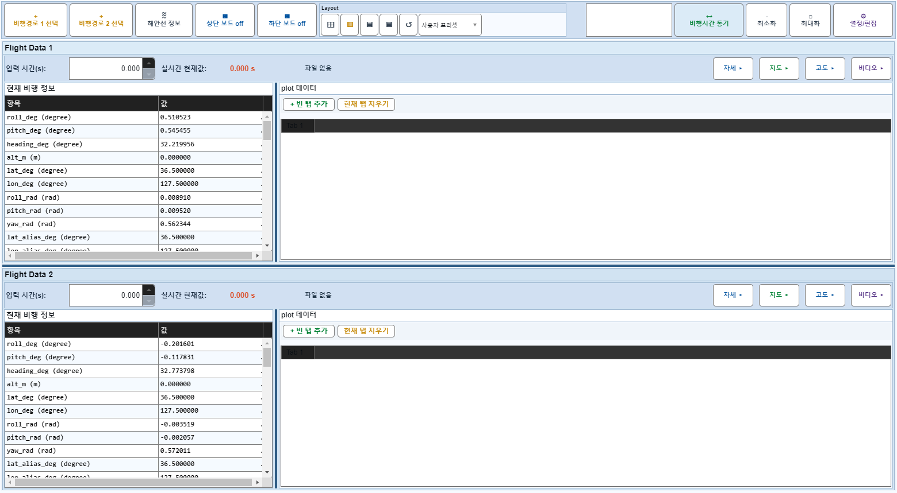
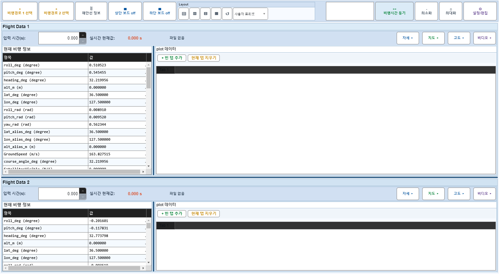

# Case 60: G-LAYOUT-10 project layout round-trip

- **그룹**: G-LAYOUT
- **검증 대상**: project UiState.Layout
- **기대 결과**: in-memory project save/load preserves layout state
- **관측 결과**: `PASS`

## 액션 시퀀스

| Step | 액션 | 캡처 |
|------|------|------|
| 01 | baseline (data loaded) |  |
| 02 | apply layout-vsplit preset |  |
| 03 | set row split ratio to 0.62 |  |
| 04 | collect/apply project layout state |  |
