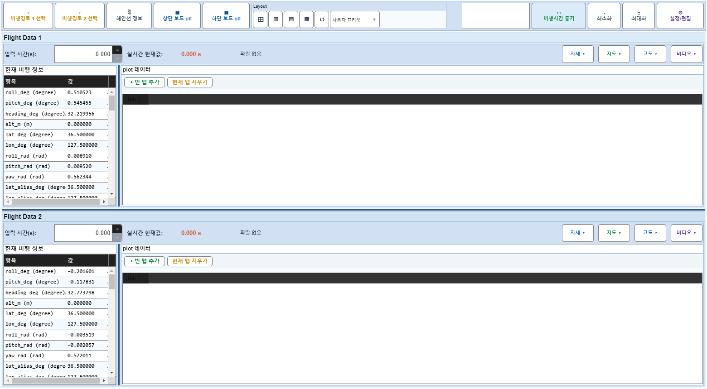
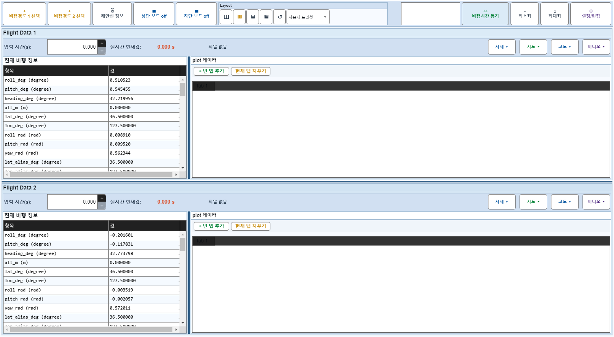
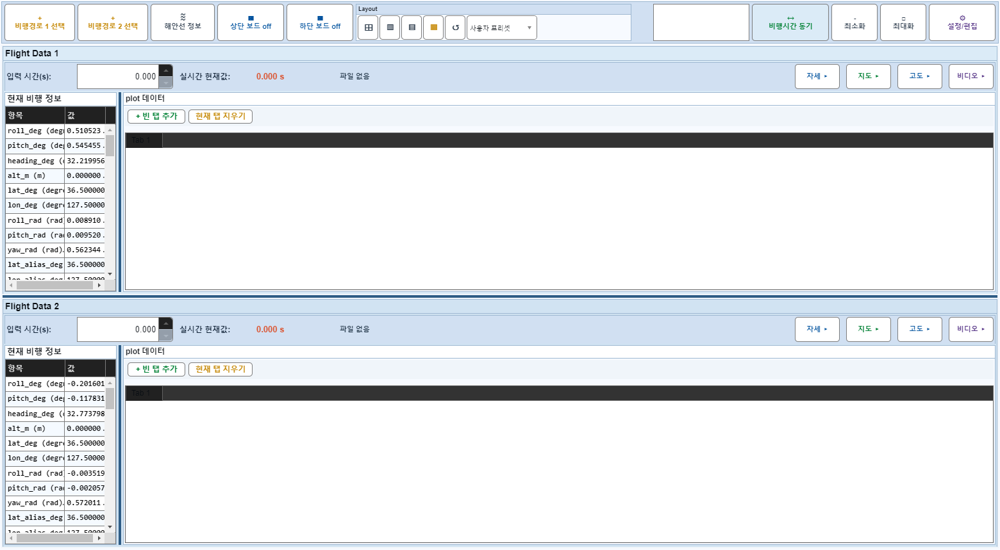
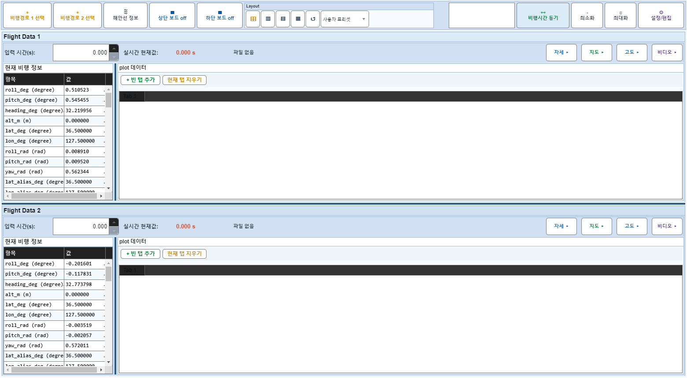

# Case 61: G-LAYOUT-11 layout preset preserves PanelVisible

- **그룹**: G-LAYOUT
- **검증 대상**: arrangement only
- **기대 결과**: preset does not toggle panels
- **관측 결과**: `PASS`

## 액션 시퀀스

| Step | 액션 | 캡처 |
|------|------|------|
| 01 | baseline (data loaded) |  |
| 02 | apply layout-vsplit |  |
| 03 | apply layout-compact |  |
| 04 | back to grid |  |
