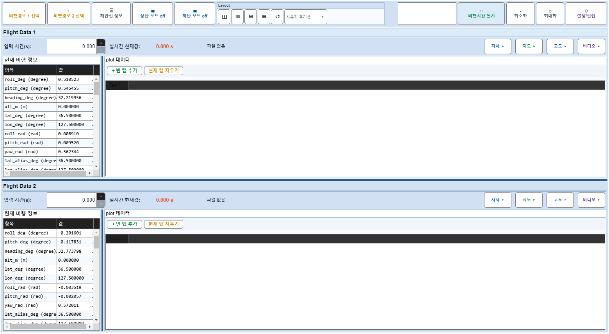
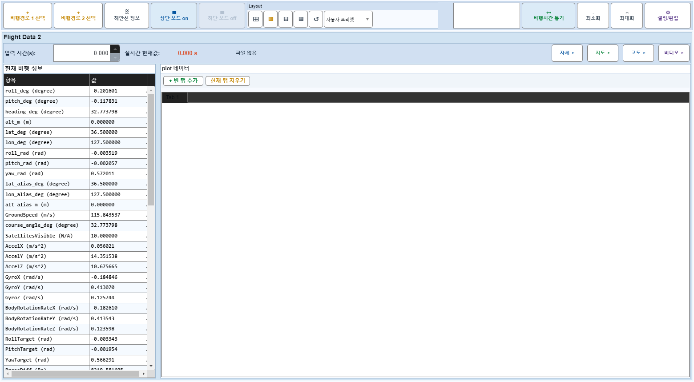
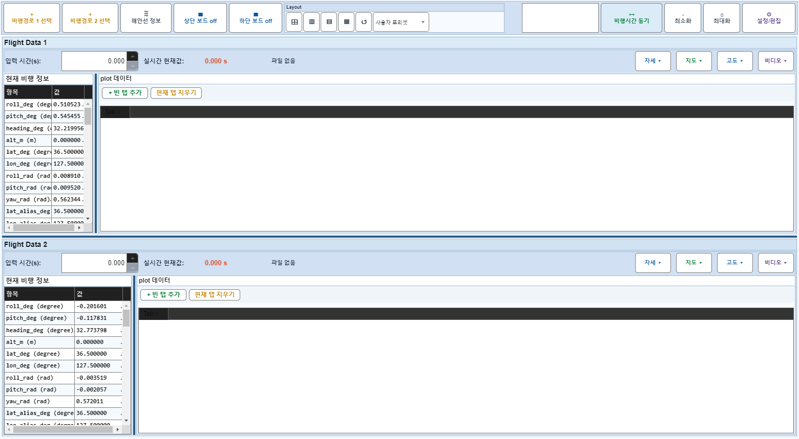

# Case 62: G-LAYOUT-12 layout preset preserves BoardOffState

- **그룹**: G-LAYOUT
- **검증 대상**: arrangement only
- **기대 결과**: preset does not change board-off
- **관측 결과**: `PASS`

## 액션 시퀀스

| Step | 액션 | 캡처 |
|------|------|------|
| 01 | baseline (data loaded) |  |
| 02 | upper board off |  |
| 03 | apply preset while board off |  |
| 04 | apply another preset |  |
| 05 | upper board on |  |
