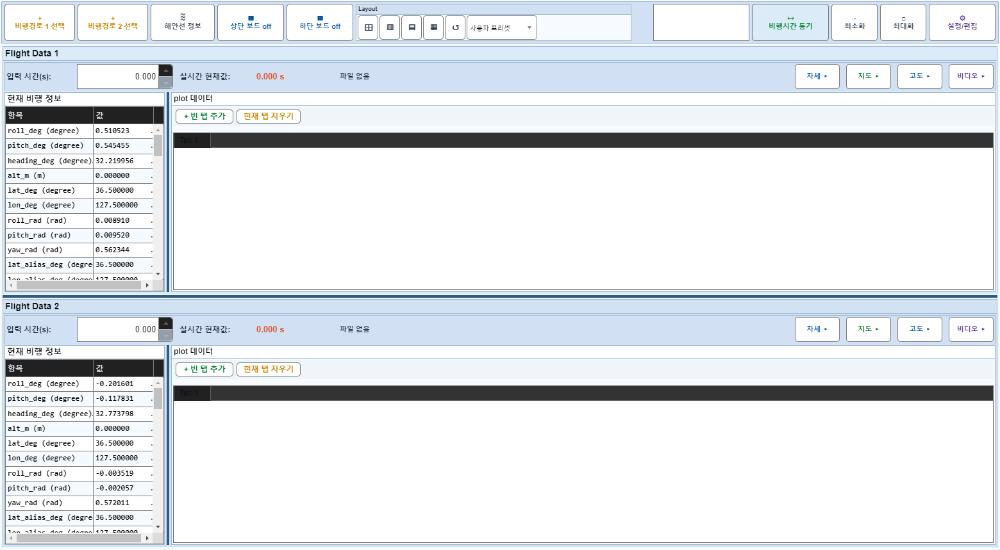
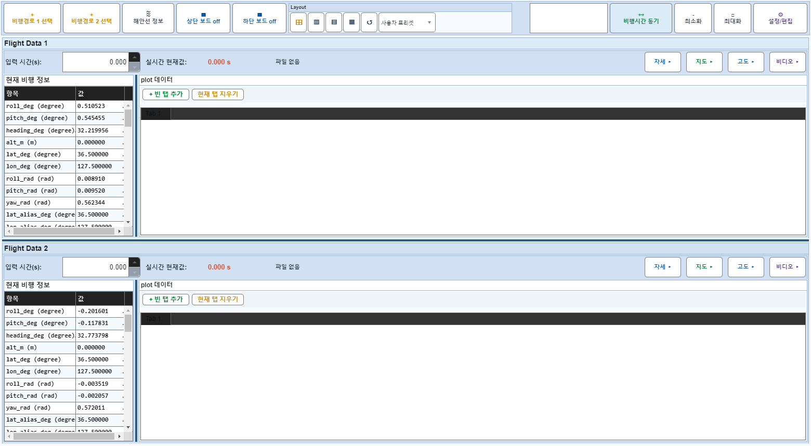
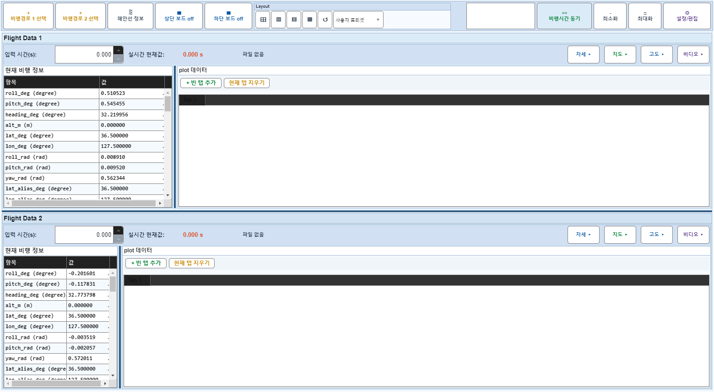
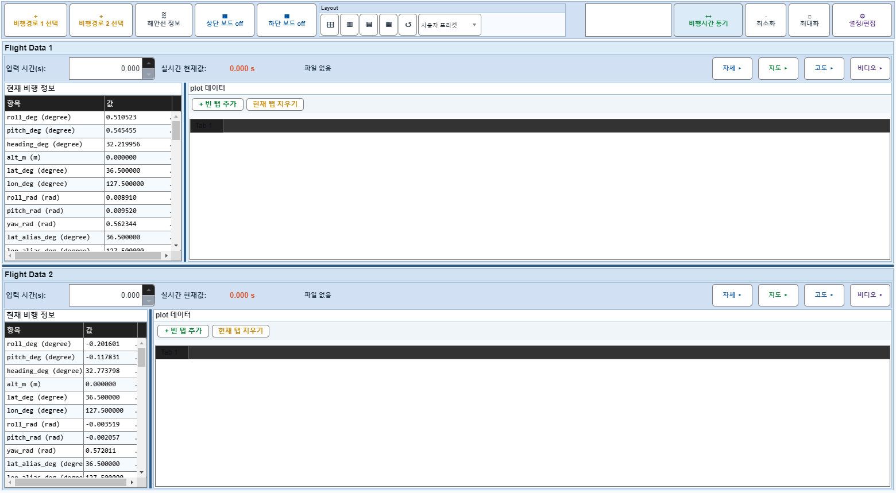
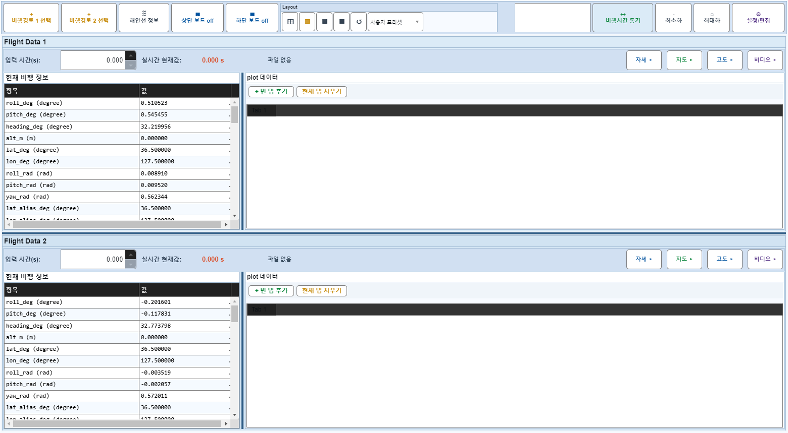

# Case 63: G-LAYOUT-13 splitter drag keeps plot = 1x

- **그룹**: G-LAYOUT
- **검증 대상**: plot flex guard
- **기대 결과**: info/plot splitter does not freeze plot to numeric
- **관측 결과**: `PASS`

## 액션 시퀀스

| Step | 액션 | 캡처 |
|------|------|------|
| 01 | baseline (data loaded) |  |
| 02 | baseline grid |  |
| 03 | drag info/plot splitter |  |
| 04 | drag back |  |
| 05 | reapply preset |  |
