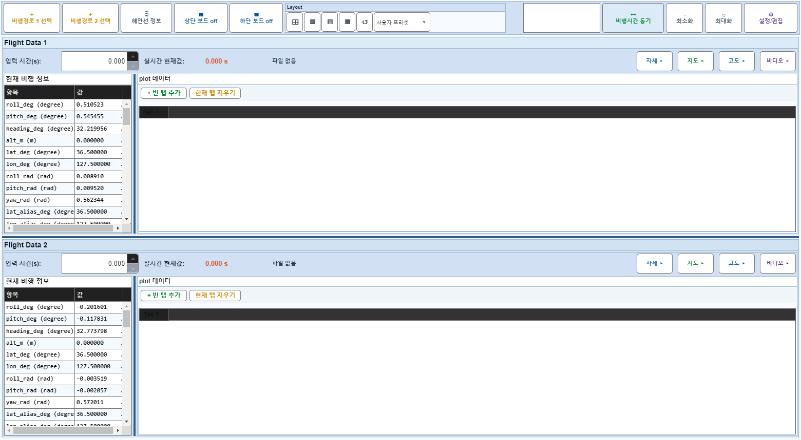
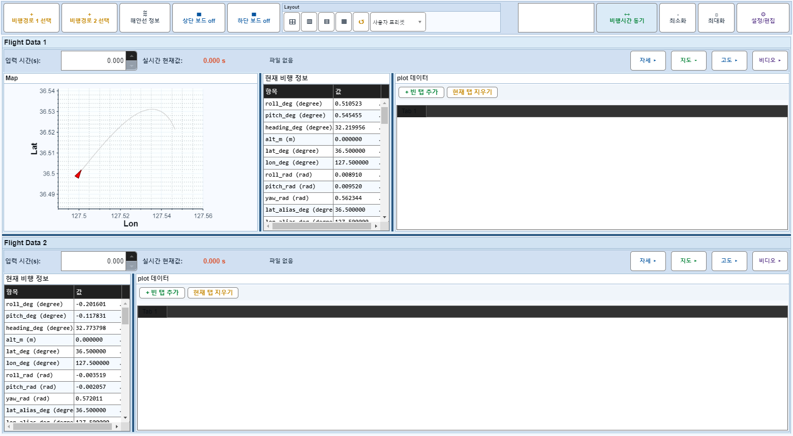

# Case 64: G-LAYOUT-14 layout-reset preserves PanelVisible+BoardOff

- **그룹**: G-LAYOUT
- **검증 대상**: reset narrow
- **기대 결과**: reset clears widths only, not visibility
- **관측 결과**: `PASS`

## 액션 시퀀스

| Step | 액션 | 캡처 |
|------|------|------|
| 01 | baseline (data loaded) |  |
| 02 | hide map |  |
| 03 | reset widths |  |
| 04 | restore map |  |
