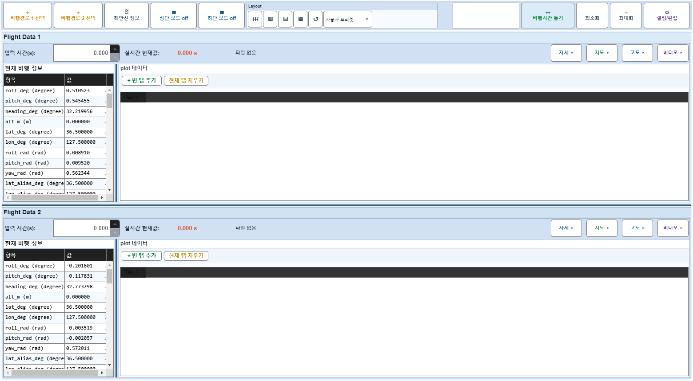
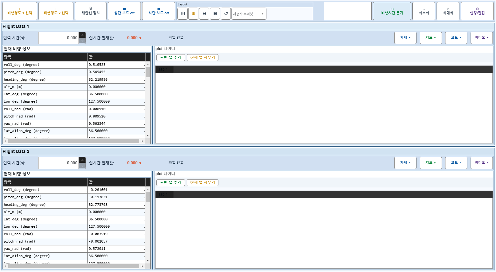
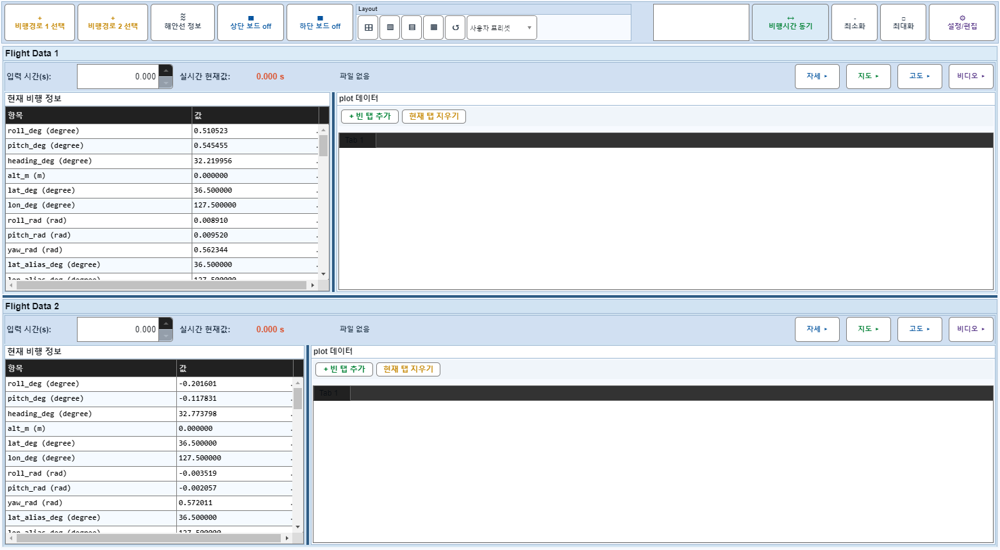
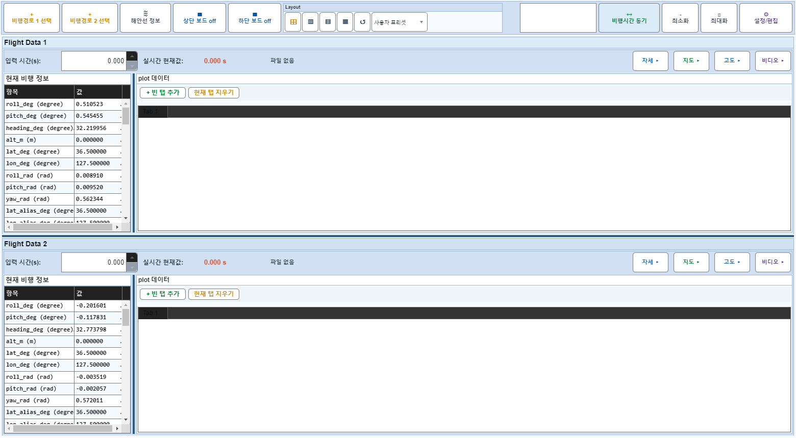
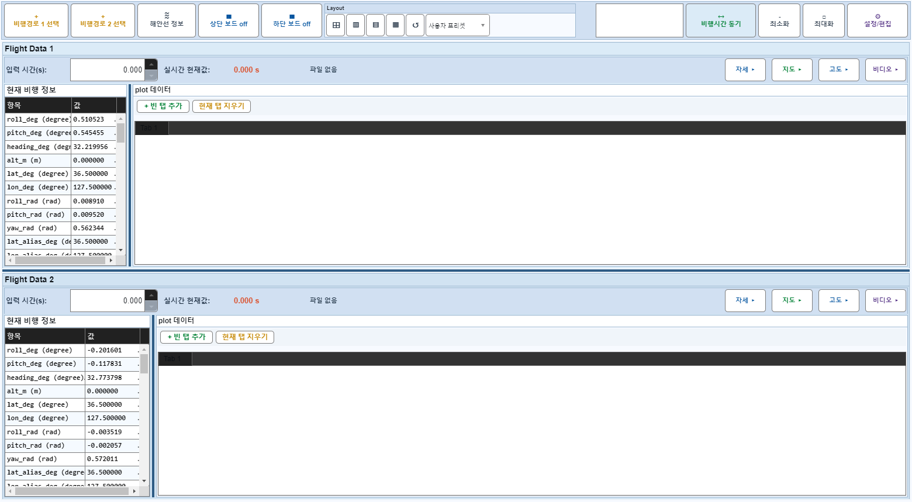
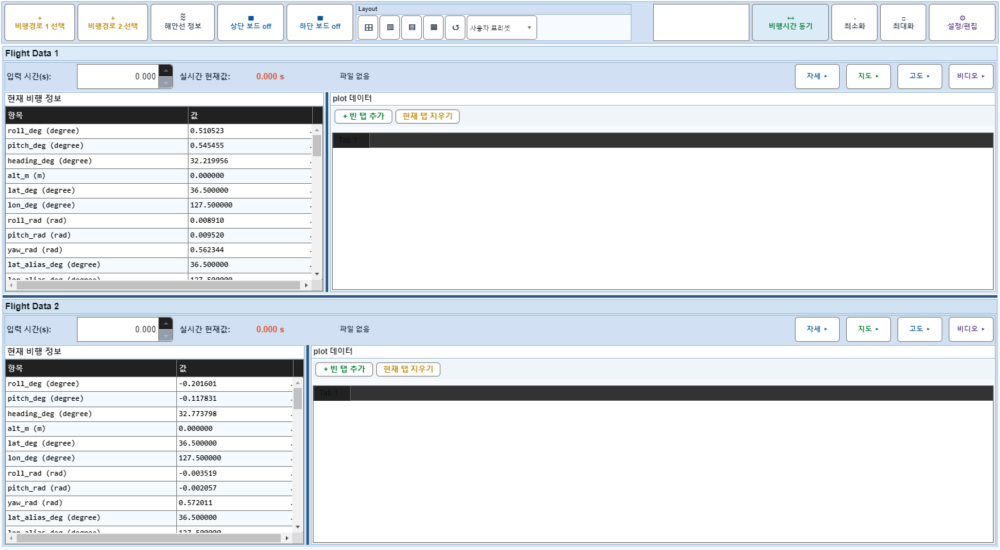

# Case 65: G-LAYOUT-15 repeated cycle no drift

- **그룹**: G-LAYOUT
- **검증 대상**: repeated apply
- **기대 결과**: preset+drag cycle stable, no progressive drift
- **관측 결과**: `PASS`

## 액션 시퀀스

| Step | 액션 | 캡처 |
|------|------|------|
| 01 | baseline (data loaded) |  |
| 02 | vsplit |  |
| 03 | drag1 |  |
| 04 | grid |  |
| 05 | drag2 |  |
| 06 | vsplit again |  |
| 07 | drag3 |  |
