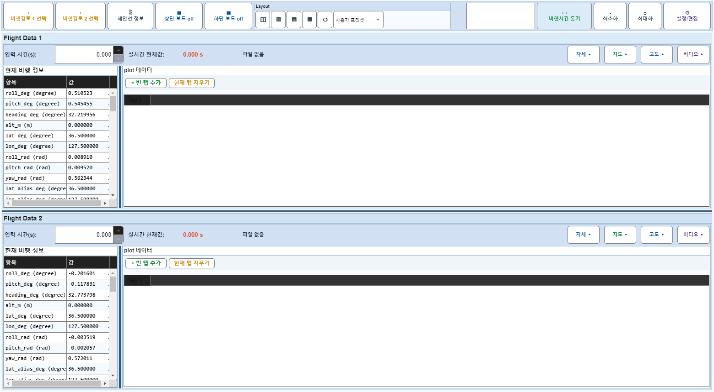
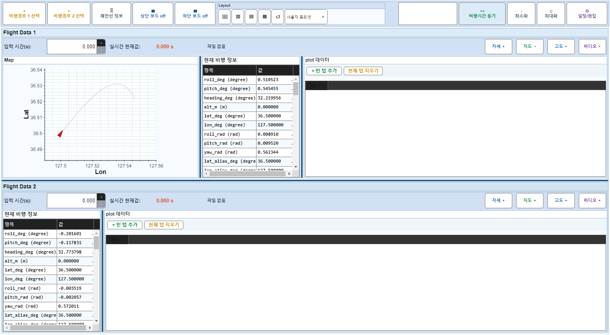
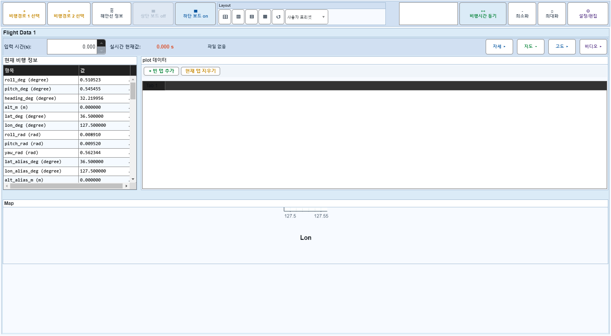

# Case 67: G-LAYOUT-17 mapOnly hide + lower board off

- **그룹**: G-LAYOUT
- **검증 대상**: combo: mapOnly off + lower off
- **기대 결과**: arrangement valid
- **관측 결과**: `PASS`

## 액션 시퀀스

| Step | 액션 | 캡처 |
|------|------|------|
| 01 | baseline (data loaded) |  |
| 02 | flight1 mapOnly off |  |
| 03 | lower board off |  |
| 04 | lower board on |  |
