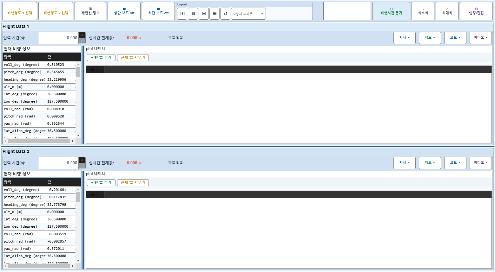
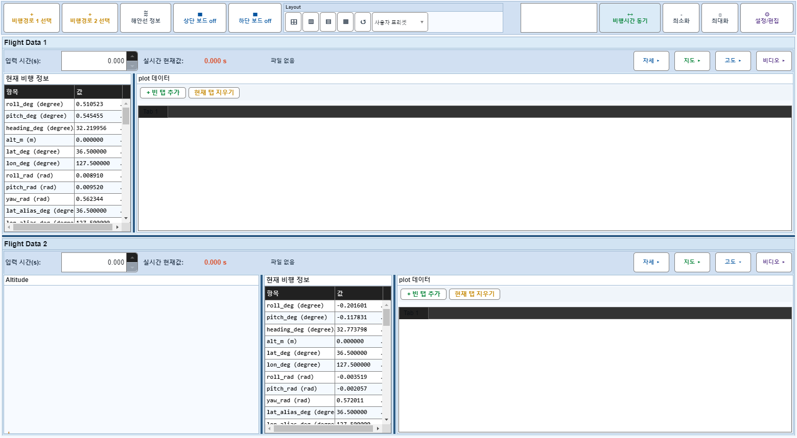
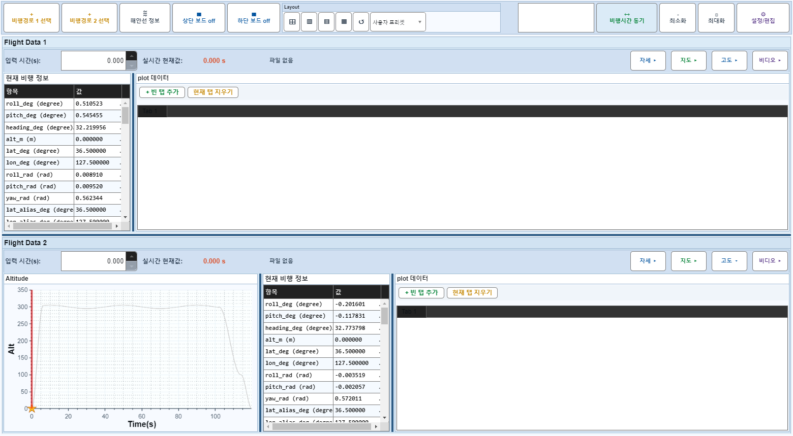
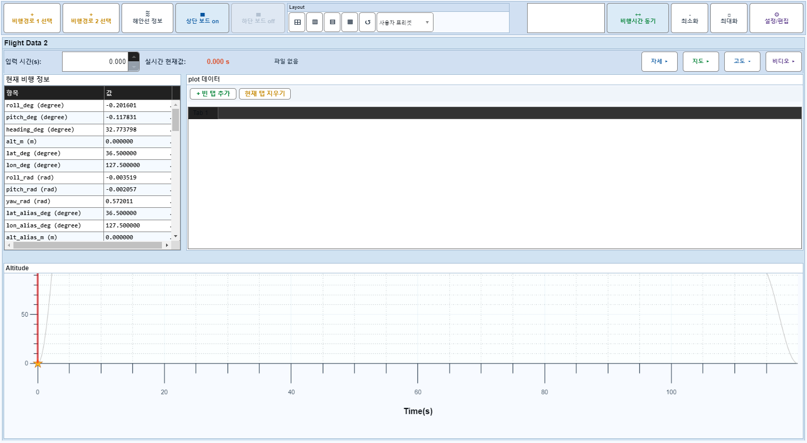

# Case 68: G-LAYOUT-18 altOnly hide + upper board off

- **그룹**: G-LAYOUT
- **검증 대상**: combo: altOnly off + upper off
- **기대 결과**: arrangement valid
- **관측 결과**: `PASS`

## 액션 시퀀스

| Step | 액션 | 캡처 |
|------|------|------|
| 01 | baseline (data loaded) |  |
| 02 | flight2 altOnly off |  |
| 03 | upper board off |  |
| 04 | upper board on |  |
