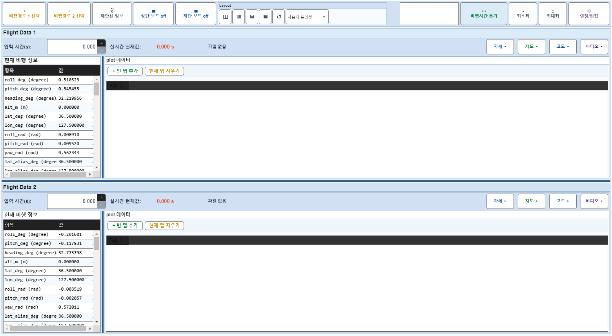
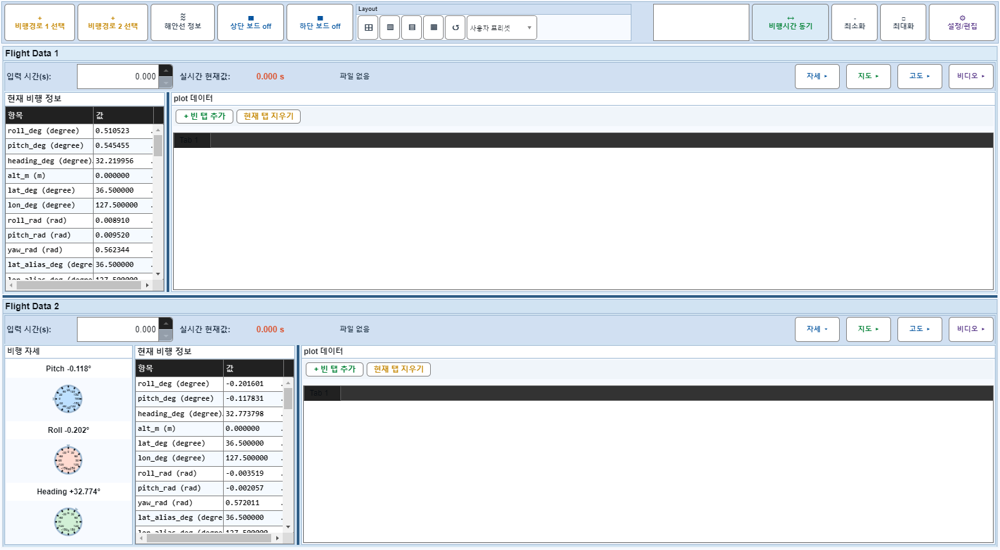
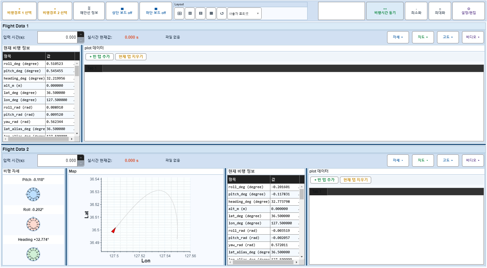
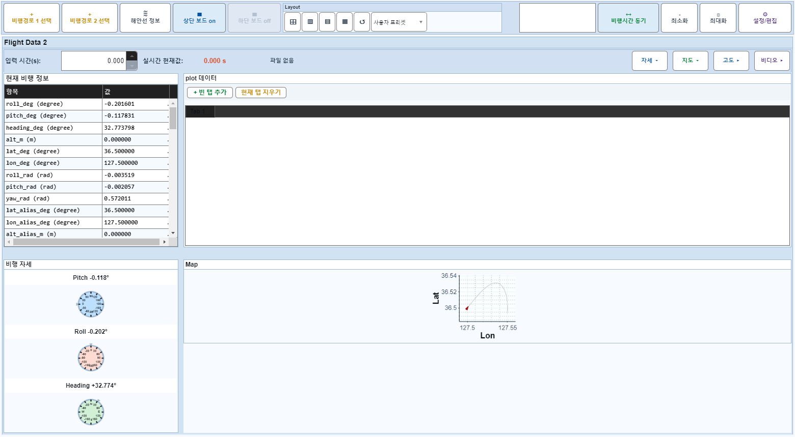
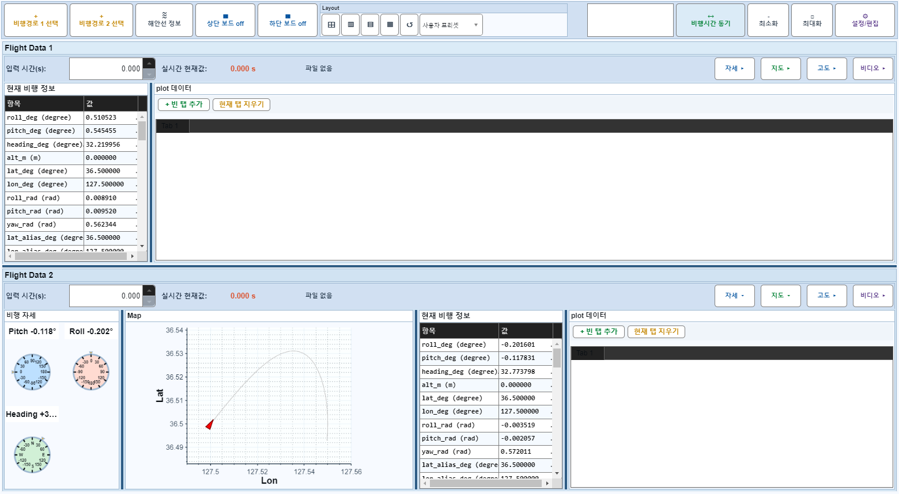

# Case 69: G-LAYOUT-19 attitude+mapOnly hide + board off

- **그룹**: G-LAYOUT
- **검증 대상**: combo: multi hide + off
- **기대 결과**: lower region empty handled
- **관측 결과**: `PASS`

## 액션 시퀀스

| Step | 액션 | 캡처 |
|------|------|------|
| 01 | baseline (data loaded) |  |
| 02 | off |  |
| 03 | off |  |
| 04 | upper off |  |
| 05 | upper on |  |
