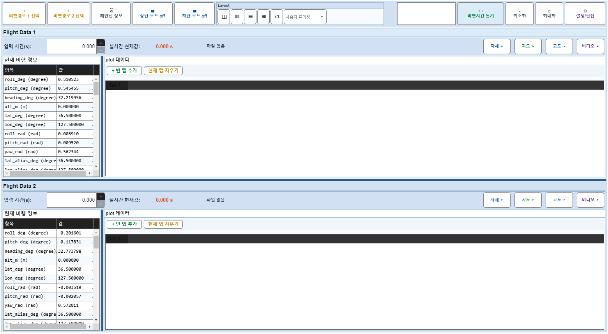
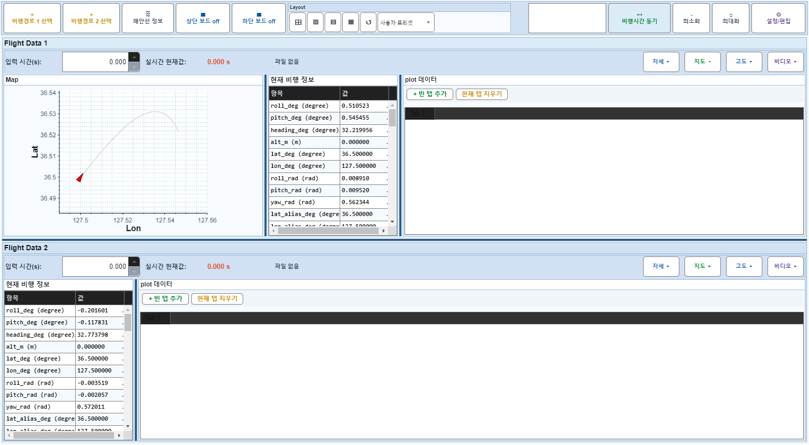
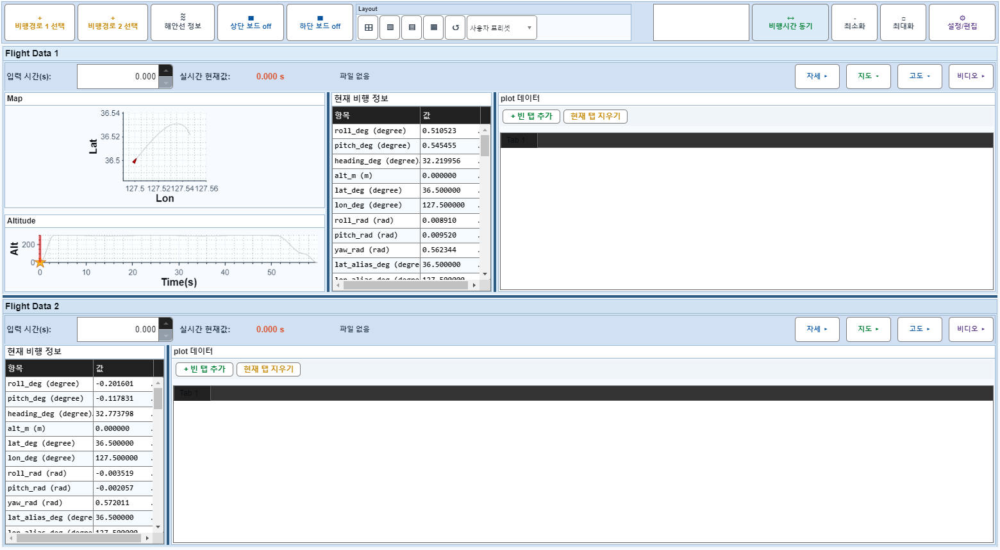
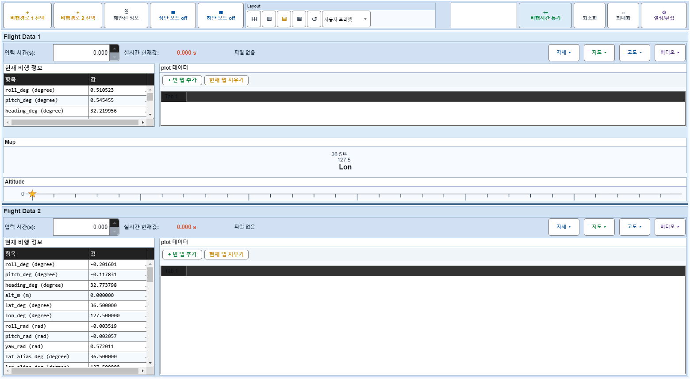

# Case 72: G-LAYOUT-22 hsplit + attitude only

- **그룹**: G-LAYOUT
- **검증 대상**: combo: hsplit + lower attitude-only
- **기대 결과**: attitude col span [1 3] horizontal layout
- **관측 결과**: `FAIL`

## 액션 시퀀스

| Step | 액션 | 캡처 |
|------|------|------|
| 01 | baseline (data loaded) |  |
| 02 | off |  |
| 03 | off |  |
| 04 | hsplit |  |

## Failure Detail
```
step 4 (hsplit): board 1 info/plot column hidden after board-on restore; board 2 info/plot column hidden after board-on restore; board 1 attitude column left blank while panel hidden; board 1 info column collapsed while panel visible; board 1 dataView column collapsed while panel visible; board 1 column splitter visibility mismatch; board 2 attitude column left blank while panel hidden; board 2 map column left blank while panel hidden; board 2 info column collapsed while panel visible; board 2 dataView column collapsed while panel visible; board 2 column splitter visibility mismatch
State snapshot: BoardOff actual=[false false] expected=[false false]; F1{off=0,panel=1,idx=1,time=0.000,spin=0.000,tabs=1/1,plots=0/0,selPlots=0/0,colsHidden=[1 1 1],summary=0,boPlots=0,boMarkers=0,video=[sync=0 frame=1/0]}; F2{off=0,panel=1,idx=1,time=0.000,spin=0.000,tabs=1/1,plots=0/0,selPlots=0/0,colsHidden=[1 1 1],summary=0,boPlots=0,boMarkers=0,video=[sync=0 frame=1/0]}
```
