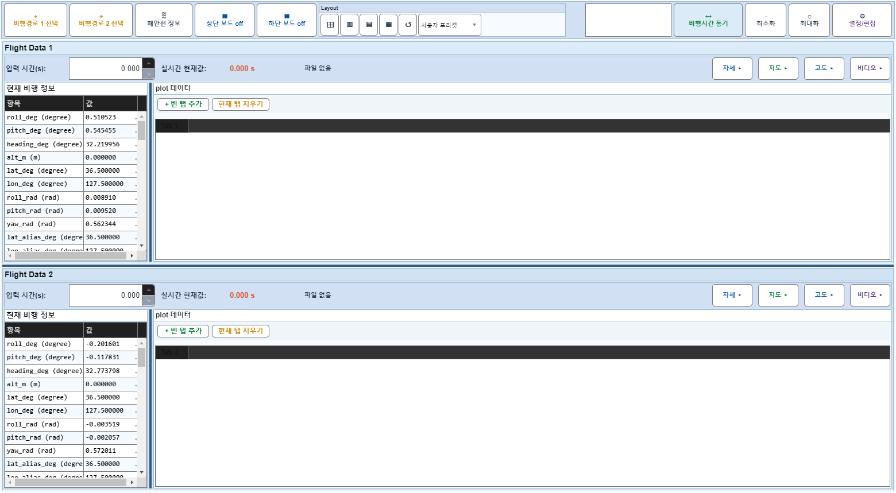
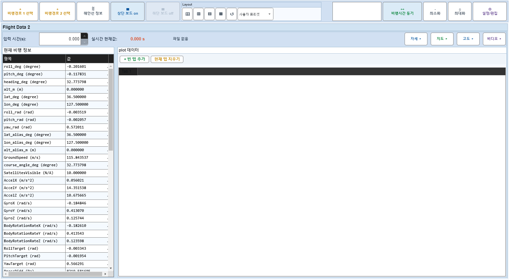
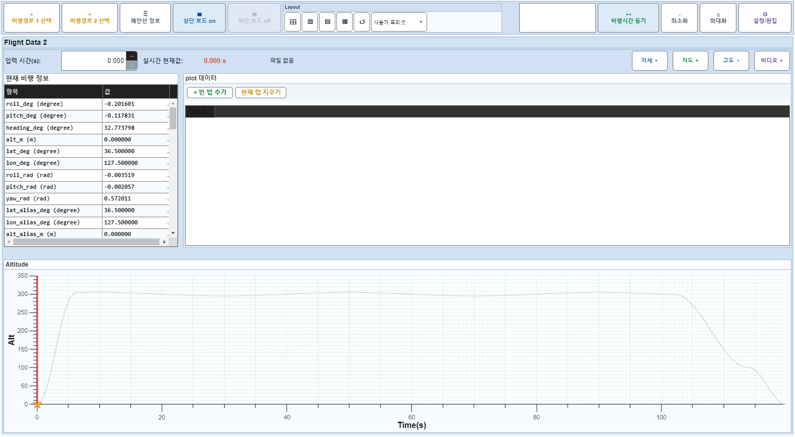
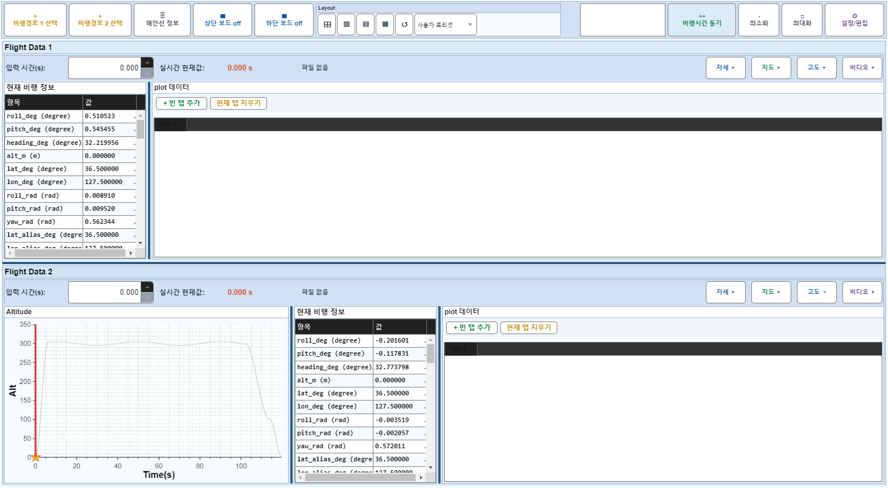

# Case 78: G-LAYOUT-28 source-board altOnly toggle during board-off

- **그룹**: G-LAYOUT
- **검증 대상**: panel toggle during board-off persists after board-on
- **기대 결과**: v-final P8
- **관측 결과**: `PASS`

## 액션 시퀀스

| Step | 액션 | 캡처 |
|------|------|------|
| 01 | baseline (data loaded) |  |
| 02 | upper board off |  |
| 03 | source flight2 altOnly toggle |  |
| 04 | upper board on |  |
