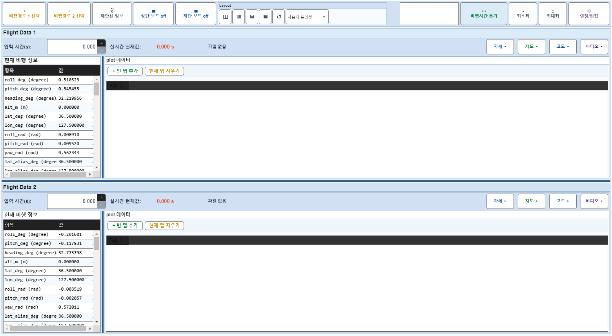

# Case 79: G-EDIT-01 open + close EditDialog

- **그룹**: G-EDIT
- **검증 대상**: dialog lifecycle
- **기대 결과**: open/close 정상
- **관측 결과**: `PASS`

## 액션 시퀀스

| Step | 액션 | 캡처 |
|------|------|------|
| 01 | baseline (data loaded) |  |
| 02 | open EditDialog |  |
| 03 | close EditDialog |  |
