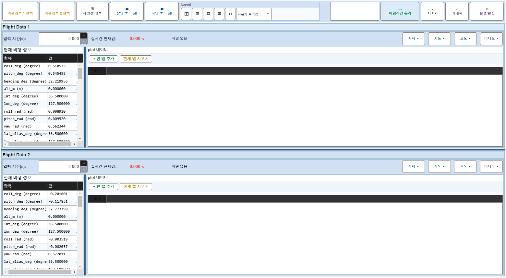

# Case 80: G-EDIT-02 switch all 6 tabs

- **그룹**: G-EDIT
- **검증 대상**: 6 tab traversal
- **기대 결과**: Project/Files/Sync/Options/Plot Manager/Export 탐색
- **관측 결과**: `PASS`

## 액션 시퀀스

| Step | 액션 | 캡처 |
|------|------|------|
| 01 | baseline (data loaded) |  |
| 02 | open |  |
| 03 | tab=Project |  |
| 04 | tab=Files |  |
| 05 | tab=Sync |  |
| 06 | tab=Options |  |
| 07 | tab=Plot Manager |  |
| 08 | tab=Export |  |
| 09 | close |  |
