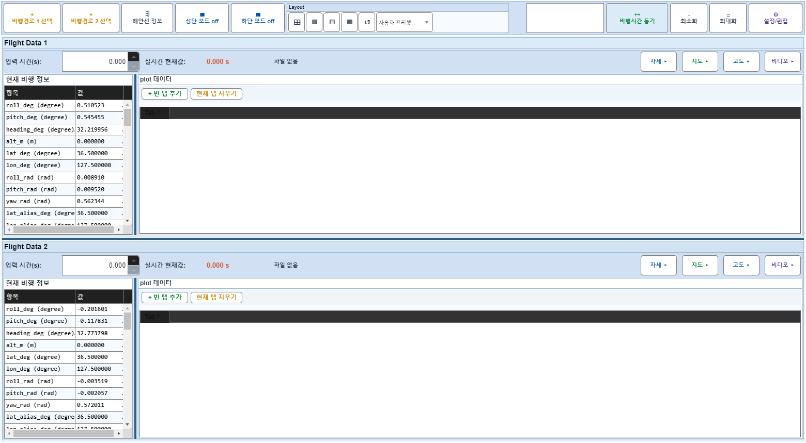

# Case 81: G-EDIT-03 Plot Manager capture + rebuild

- **그룹**: G-EDIT
- **검증 대상**: Plot Manager apply path
- **기대 결과**: capture/rebuild 정상
- **관측 결과**: `PASS`

## 액션 시퀀스

| Step | 액션 | 캡처 |
|------|------|------|
| 01 | baseline (data loaded) |  |
| 02 | open |  |
| 03 | tab=Plot Manager |  |
| 04 | capturePlotConfig |  |
| 05 | rebuildPlots |  |
| 06 | close |  |
