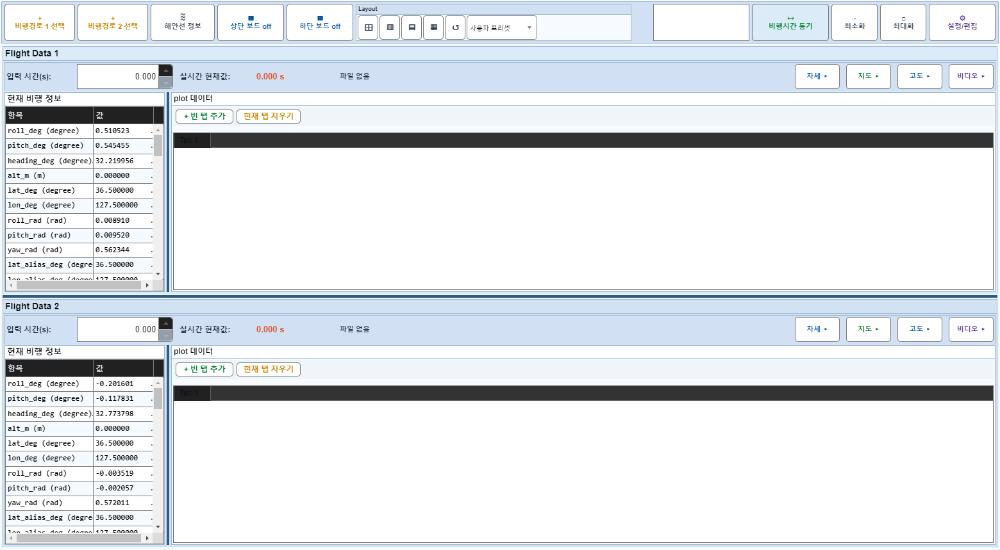

# Case 82: G-EDIT-04 Plot Manager X/Y auto toggle

- **그룹**: G-EDIT
- **검증 대상**: XLimMode/YLimMode auto
- **기대 결과**: X/Y auto on/off cycle
- **관측 결과**: `PASS`

## 액션 시퀀스

| Step | 액션 | 캡처 |
|------|------|------|
| 01 | baseline (data loaded) |  |
| 02 | open |  |
| 03 | tab=Plot Manager |  |
| 04 | X auto on |  |
| 05 | X auto off |  |
| 06 | Y auto off |  |
| 07 | Y auto on |  |
| 08 | close |  |
