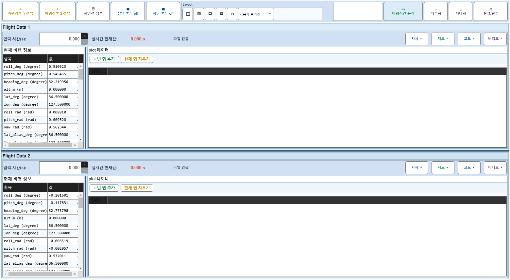

# Case 88: G-EDIT-10 close auto-applies pending changes

- **그룹**: G-EDIT
- **검증 대상**: close finalize
- **기대 결과**: close 시 pending apply
- **관측 결과**: `PASS`

## 액션 시퀀스

| Step | 액션 | 캡처 |
|------|------|------|
| 01 | baseline (data loaded) |  |
| 02 | open |  |
| 03 | tab=Plot Manager |  |
| 04 | apply |  |
| 05 | close |  |
