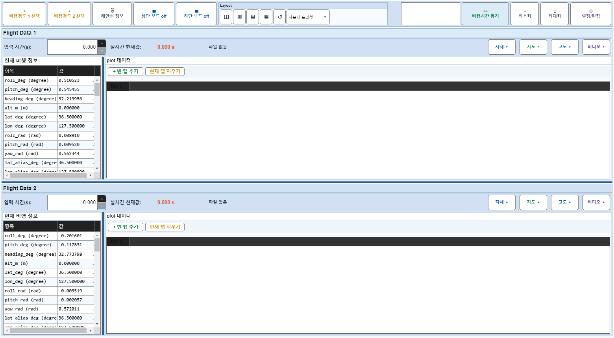
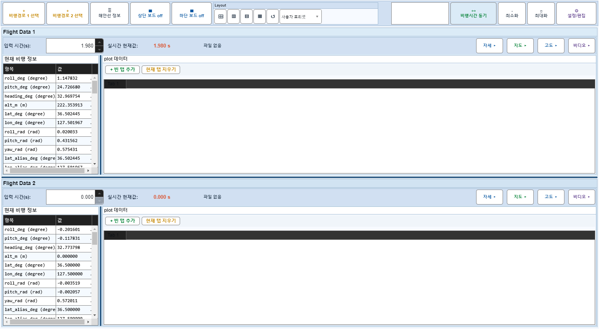

# Case 49: E04 AVI 동기 + applyTimeChange

- **그룹**: E
- **검증 대상**: 동기 후 frame 추종
- **기대 결과**: video frame 변화
- **관측 결과**: `FAIL`

## 액션 시퀀스

| Step | 액션 | 캡처 |
|------|------|------|
| 01 | baseline (data loaded) |  |
| 02 | setVideoSync(1,230,36.56,35,50) |  |
| 03 | applyTimeChange(1,100) |  |

## Failure Detail
```
step 3 (applyTimeChange(1,100)): board 1 video frame did not move after time change
State snapshot: BoardOff actual=[false false] expected=[false false]; F1{off=0,panel=1,idx=100,time=1.980,spin=1.980,tabs=1/1,plots=0/0,selPlots=0/0,colsHidden=[0 0 0],summary=0,boPlots=0,boMarkers=0,video=[sync=1 frame=1/46525]}; F2{off=0,panel=1,idx=1,time=0.000,spin=0.000,tabs=1/1,plots=0/0,selPlots=0/0,colsHidden=[0 0 0],summary=0,boPlots=0,boMarkers=0,video=[sync=0 frame=1/165205]}
```
