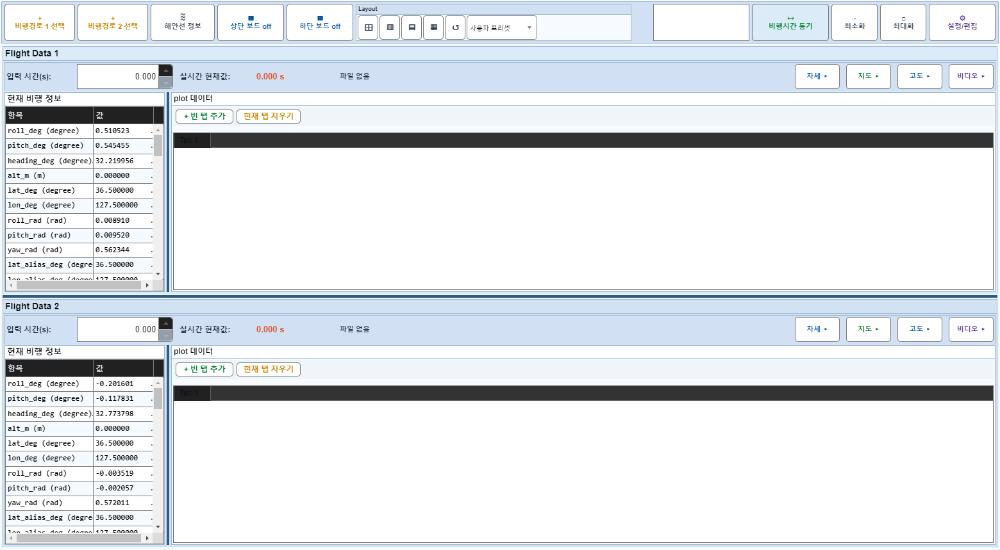
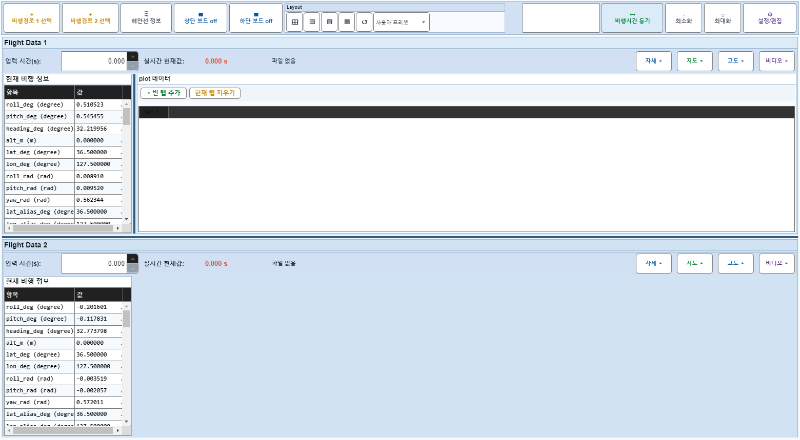

# Case 71: G-LAYOUT-21 dataView hide before board off → forced visible

- **그룹**: G-LAYOUT
- **검증 대상**: combo: dataView hide + board off forces dataView
- **기대 결과**: v3-audit B
- **관측 결과**: `FAIL`

## 액션 시퀀스

| Step | 액션 | 캡처 |
|------|------|------|
| 01 | baseline (data loaded) |  |
| 02 | flight2 dataView off |  |

## Failure Detail
```
step 2 (flight2 dataView off): board 2 info/plot column hidden after board-on restore
State snapshot: BoardOff actual=[false false] expected=[false false]; F1{off=0,panel=1,idx=1,time=0.000,spin=0.000,tabs=1/1,plots=0/0,selPlots=0/0,colsHidden=[0 0 0],summary=0,boPlots=0,boMarkers=0,video=[sync=0 frame=1/46525]}; F2{off=0,panel=1,idx=1,time=0.000,spin=0.000,tabs=1/1,plots=0/0,selPlots=0/0,colsHidden=[0 1 1],summary=0,boPlots=0,boMarkers=0,video=[sync=0 frame=1/165205]}
```
