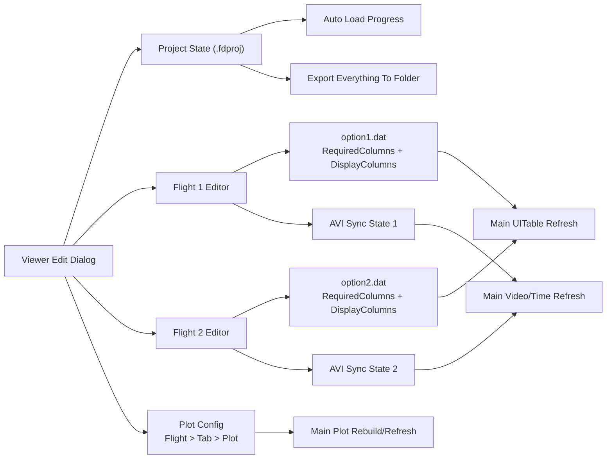

# FlightDataDashboard 편집 뷰어 Dialog 설계 및 코드 수정계획서

작성일: 2026-06-03  
대상 파일: `FlightDataDashboard.m`  
목표: 비행데이터, AVI 동기화, option 파일, plot 설정, project 파일, export 기능을 한 곳에서 편집하고 주 화면에 지연 자동 반영한다.

## 1. 설계 확정안

- 편집 창은 메인 `FlightDataDashboard`와 별도 `uifigure`로 띄우는 modeless dialog로 설계한다.
- dialog는 `Resize=on`으로 두고, OS 기본 최소화/최대화 버튼을 사용한다. MATLAB Online 환경에서 창 버튼 동작이 제한되면 내부 보조 버튼 `최소화`, `최대화/복원`을 추가한다.
- project 파일 형식은 신규 JSON 기반 `.fdproj`를 권장한다.
- `option1.dat`, `option2.dat`는 기존 텍스트 형식을 유지한다.
- option 파일의 두 영역은 반드시 분리 편집한다.
  - `# RequiredColumns`: Time/Roll/Pitch/Heading/Alt/Lat/Lon 매핑
  - `# DisplayColumns`: 항목명, 단위, 표시 format, 순서, scale
- option 편집 후 `적용`을 누르면 주 화면의 `현재 비행 정보` `uitable`에 즉시 반영한다.
- 대용량 AVI는 export 시 메모리에 올리지 않고 `copyfile`로 파일 단위 복사한다.
- 주 화면 자동 반영은 debounce timer로 처리한다. 사용자가 연속 편집 중일 때 매번 전체 refresh하지 않는다.

## 2. 예시 그림

### 2.1 Dialog 화면 와이어프레임

```text
┌──────────────────────────────────────────────────────────────────────────────┐
│ 설정/프로젝트 편집기                                      [최소화] [최대화] [닫기] │
├──────────────────────────────────────────────────────────────────────────────┤
│ [Project] [Files] [Sync] [Options] [Plot Manager] [Export]                   │
├──────────────────────────────────────────────────────────────────────────────┤
│ Flight 선택: [Flight 1 ▼]                         상태: 변경됨 ●  자동반영 대기 │
├───────────────────────┬──────────────────────────────────────────────────────┤
│ 왼쪽 목록/트리          │ 오른쪽 편집 영역                                      │
│                       │                                                      │
│ ▸ Flight 1            │  선택 항목: Flight 1 / Plot Tab 2 / Plot 1             │
│   ▸ 파일 경로          │                                                      │
│   ▸ AVI Sync          │  Y 데이터 항목: [alt_m ▼]       단위: [m]              │
│   ▸ Option            │  X 최소/최대: [0.000] [60.000]  [현재 탭에 적용]        │
│   ▸ Plot Tabs         │  Y 최소/최대: [auto]  [auto]    [전체 탭 X 동기화]      │
│      ▸ Tab 1          │  Plot 높이: [120 px]            [선택 탭으로 복사]      │
│      ▸ Tab 2          │                                                      │
│ ▸ Flight 2            │  [미리보기 갱신] [적용] [저장] [되돌리기]               │
├───────────────────────┴──────────────────────────────────────────────────────┤
│ Progress: project 저장 대기 | 마지막 자동 반영 2026-06-03 16:20:00             │
└──────────────────────────────────────────────────────────────────────────────┘
```

### 2.2 구조도



## 3. Dialog 탭 설계

### 3.1 Project 탭

목적: project 파일 열기/저장, 변경 상태 확인, 자동 저장 정책 설정.

UI 구성:
- `Project 파일`: 현재 project 경로 표시
- `열기`, `다른 이름으로 저장`, `저장`
- `자동 저장`: on/off
- `종료 전 저장 확인`: on/off
- `마지막 저장 시간`, `변경 상태`

동작:
- project 열기 시 `uiprogressdlg`로 단계 표시 후 자동 업로드한다.
- project 저장 시 현재 flight file, AVI file, option file, sync, plot config, UI 상태를 저장한다.
- 프로그램 종료 전 dirty 상태면 저장 확인 dialog를 띄운다.

### 3.2 Files 탭

목적: Flight 1/2의 비행데이터, AVI 파일, option 파일 경로를 확인하고 변경한다.

UI 구성:
- Flight selector: `Flight 1`, `Flight 2`
- 비행데이터 파일 경로
- AVI 파일 경로
- option 파일 경로
- `파일 변경`, `다시 로드`, `project에 저장`
- `Export everything to folder` 버튼

동작:
- 비행데이터 변경 시 해당 flight의 raw data를 다시 로드한다.
- AVI 변경 시 해당 flight의 `VideoReader`, frame cache, video sync 상태를 재초기화한다.
- option 변경 시 option parser를 다시 실행하고 `uitable`을 즉시 갱신한다.

### 3.3 Sync 탭

목적: 두 종류의 sync를 분리해서 편집한다.

편집 대상:
- Flight 1 데이터 ↔ Flight 1 AVI sync
- Flight 2 데이터 ↔ Flight 2 AVI sync
- Flight 1 데이터 ↔ Flight 2 데이터 sync

UI 구성:
- Flight/AVI sync 영역
  - Flight 선택
  - 기준 frame
  - 기준 flight time
  - video fps
  - data fps
  - 총 frame 수 read-only
  - `동기 적용`, `동기 해제`, `현재 화면값 가져오기`
- Flight 1/2 data sync 영역
  - Flight 1 기준 time
  - Flight 2 기준 time
  - offset preview
  - `동기 적용`, `동기 해제`

동작:
- AVI sync 편집 값은 기존 `VideoSyncState(fIdx)`에 반영한다.
- Flight data sync 편집 값은 기존 `SyncState`에 반영한다.
- 적용 후 메인 화면의 입력시간 spinner, 실시간 현재값 label, plot marker, AVI frame이 같은 기준으로 갱신되어야 한다.

### 3.4 Options 탭

목적: `option1.dat`, `option2.dat`의 두 영역을 안정적으로 편집한다.

UI 구성:
- Flight selector: `Flight 1`, `Flight 2`
- section tabs:
  - `RequiredColumns`
  - `DisplayColumns`
- RequiredColumns table:
  - 필수 키: Time, Roll, Pitch, Heading, Alt, Lat, Lon
  - 매핑 column dropdown
- DisplayColumns table:
  - 표시 여부
  - header
  - unit
  - format
  - order
  - scale
- 버튼:
  - `검증`
  - `적용`
  - `option 파일 저장`
  - `원본으로 되돌리기`

즉시 반영 정책:
- `적용` 버튼:
  1. option table 입력값 검증
  2. `Models(fIdx).mappedCols` 갱신
  3. `Models(fIdx).displayMeta` 갱신
  4. `setupDataUI(fIdx)` 또는 table data refresh 호출
  5. 현재 선택 시간 기준으로 `updateAllDisplays(fIdx)` 호출
  6. project dirty flag 설정
- `option 파일 저장` 버튼:
  - 임시 파일에 먼저 쓰고 성공 시 원본 교체
  - 저장 전 `.bak` 백업 생성

중요 구현 주의:
- 현재 `applyOptionFile`은 scale 적용 시 `rawData` 값을 직접 곱한다.
- option을 반복 적용하면 scale이 중복 적용될 수 있다.
- 개선안: `Models(fIdx).sourceData` 또는 `Models(fIdx).rawDataUnscaled`를 추가하고, option 적용 때마다 원본 unscaled table에서 `rawData`를 재생성한다.

### 3.5 Plot Manager 탭

목적: Flight 1/2의 모든 tab/plot을 목록화하고 세부 옵션을 수정한다.

UI 구성:
- 왼쪽 tree:
  - Flight 1
    - Tab 1
      - Plot 1: `alt_m`
      - Plot 2: `roll_deg`
    - Tab 2
  - Flight 2
    - Tab 1
- 오른쪽 속성 편집:
  - plot 표시 이름
  - y축 데이터 항목 dropdown
  - y축 label preview
  - x min, x max
  - y min, y max
  - y auto range on/off
  - plot height/size
  - plot 순서
  - 삭제/복제
- 동기 버튼:
  - `선택 plot X범위를 모든 flight 모든 tab 모든 plot에 적용`
  - `현재 tab X범위를 선택 tab에 적용`
  - `현재 tab X범위를 모든 tab에 적용`

기존 코드와 충돌 가능성:
- 현재 `plotSelectedVariable`에서 같은 tab의 axes를 `linkaxes(allAxes, 'x')`로 묶는다.
- 요구사항에는 plot별 x축 범위 수정도 있으므로 무조건 link하면 개별 범위 편집이 무력화된다.
- 개선안:
  - `PlotConfig(fIdx).Tabs(tabIdx).LinkXWithinTab` 속성 추가
  - 기본값은 true
  - 사용자가 개별 plot x범위를 수정하면 해당 tab의 link를 자동 off하거나 확인 후 off
  - tab 단위 x범위 적용은 link on/off와 무관하게 programmatic update로 처리

PlotConfig 예시:

```json
{
  "Flights": [
    {
      "PlotTabs": [
        {
          "Title": "Tab 1",
          "LinkXWithinTab": true,
          "DefaultXLim": [0, 60],
          "Plots": [
            {
              "YColumn": "alt_m",
              "YLabel": "alt_m (m)",
              "XLim": [0, 60],
              "YLimMode": "auto",
              "YLim": null,
              "Height": 120,
              "Order": 1
            }
          ]
        }
      ]
    }
  ]
}
```

### 3.6 Export 탭

목적: project 파일에 기록된 모든 파일을 현재 시간 폴더로 복사하고, 복사된 project 파일의 경로를 새 폴더 기준으로 변경한다.

UI 구성:
- export 대상 폴더 parent 선택
- 생성될 폴더명 preview: `FlightDashboard_yyyy-mm-dd_HH-MM-SS`
- 복사 대상 목록:
  - project file
  - flight data 1/2
  - AVI 1/2
  - option1/option2
  - coastline/area option 파일
  - 기타 project에 기록된 auxiliary 파일
- `Export everything to folder` 버튼
- progress log

동작:
1. dirty project가 있으면 먼저 저장하거나 임시 project snapshot을 만든다.
2. 현재 시간 기반 폴더 생성.
3. project에 기록된 파일 경로를 수집.
4. 존재하지 않는 파일은 사용자에게 skip/중단 선택을 요구.
5. 같은 basename 충돌 시 `flight1_`, `flight2_`, `option_` prefix로 안전하게 복사.
6. 원본 project 파일도 새 폴더로 복사.
7. 복사된 project 파일 내부의 모든 관련 경로를 새 폴더 경로로 rewrite.
8. export 검증: 복사된 project 파일을 읽어서 모든 경로가 존재하는지 확인.

## 4. Project 파일 설계

권장 확장자: `.fdproj`  
권장 형식: JSON

예시:

```json
{
  "Version": 1,
  "SavedAt": "2026-06-03T16:20:00+09:00",
  "PathMode": "absolute",
  "Flights": [
    {
      "Name": "Flight 1",
      "DataFile": "D:/flightdashboard/1. 최초-MVC 전/flight_data1.dat",
      "AviFile": "D:/flightdashboard/1. 최초-MVC 전/flight_data1_fps35.avi",
      "OptionFile": "D:/flightdashboard/1. 최초-MVC 전/option1.dat",
      "VideoResolution": "720x512",
      "VideoSync": {
        "IsSynced": true,
        "AnchorFrame": 230,
        "AnchorTime": 36.56,
        "VideoFps": 35,
        "DataFps": 50
      }
    },
    {
      "Name": "Flight 2",
      "DataFile": "D:/flightdashboard/1. 최초-MVC 전/flight_data2.dat",
      "AviFile": "D:/flightdashboard/1. 최초-MVC 전/flight_data2_fps7.avi",
      "OptionFile": "D:/flightdashboard/1. 최초-MVC 전/option2.dat",
      "VideoResolution": "720x512",
      "VideoSync": {
        "IsSynced": false,
        "AnchorFrame": 0,
        "AnchorTime": 0,
        "VideoFps": 7,
        "DataFps": 50
      }
    }
  ],
  "FlightSync": {
    "IsSynced": true,
    "SyncT1": 36.56,
    "SyncT2": 59.24
  },
  "PlotConfig": {},
  "UiState": {
    "WindowPosition": [10, 50, 1450, 820],
    "EditDialogPosition": [120, 120, 1000, 680]
  },
  "AuxFiles": [
    "D:/flightdashboard/1. 최초-MVC 전/option_flight_area.dat"
  ]
}
```

## 5. 자동 업로드 progress step

project 파일을 열 때 `uiprogressdlg` 메시지는 다음 순서로 표시한다.

1. `project 파일 읽는 중`
2. `파일 경로 검증 중`
3. `Flight 1 option 파일 읽는 중`
4. `Flight 1 비행데이터 로드 중`
5. `Flight 1 AVI 메타데이터 로드 중`
6. `Flight 2 option 파일 읽는 중`
7. `Flight 2 비행데이터 로드 중`
8. `Flight 2 AVI 메타데이터 로드 중`
9. `비행데이터 동기화 상태 복원 중`
10. `plot tab 복원 중`
11. `화면 갱신 중`
12. `완료`

예외 처리:
- 누락 파일: 해당 파일명과 project 항목명을 표시하고 `건너뛰기`, `파일 다시 선택`, `중단` 중 선택.
- option validation 실패: 파일을 적용하지 않고 오류 row를 highlight.
- AVI 열기 실패: flight data는 유지하고 video만 미로드 상태로 둔다.

## 6. 메인 화면 반영 방식

### 6.1 지연 자동 업데이트

추가 속성:
- `EditDialog`
- `ProjectState`
- `ProjectFilePath`
- `ProjectDirty`
- `OptionDrafts`
- `PlotConfig`
- `EditApplyTimer`
- `LastEditApplyTime`

동작:
- dialog에서 값 변경 시 바로 heavy refresh하지 않는다.
- `markProjectDirtyAndScheduleRefresh(reason)` 호출.
- timer `StartDelay` 0.25~0.50초 후 `applyPendingDialogChanges()` 실행.
- `적용` 버튼을 누른 경우 timer를 기다리지 않고 즉시 반영한다.

### 6.2 즉시 반영 대상

- `현재 비행 정보` table
- `비행 자세` 숫자/계기
- Map/Altitude marker
- Flight tab plots
- AVI frame/time sync label
- 입력시간 spinner와 실시간 현재값 label

## 7. 코드 수정계획

### Phase 1: Project/설정 모델 추가

수정 범위:
- `properties`에 project, dialog, timer, plot config 속성 추가
- `createEmptyModel`에 source data 보관 필드 추가
- 신규 helper:
  - `createDefaultProjectState`
  - `collectCurrentProjectState`
  - `applyProjectState`
  - `loadProjectFile`
  - `saveProjectFile`
  - `normalizeProjectPaths`

검증:
- project 저장 후 다시 읽으면 동일 state가 복원되어야 한다.
- 경로가 비어 있는 flight도 오류 없이 유지되어야 한다.

### Phase 2: Options editor와 parser 개선

수정 범위:
- `applyOptionFile`을 다음 역할로 분리
  - `parseOptionFile`
  - `validateOptionDraft`
  - `buildDisplayMetaFromOption`
  - `applyOptionDraftToModel`
  - `writeOptionFileAtomic`
- `rawData` scale 중복 방지를 위해 unscaled source table 저장
- dialog의 `RequiredColumns`, `DisplayColumns` table 구성

검증:
- `RequiredColumns` 매핑 변경 후 자세/지도/고도 계산 column이 바뀌어야 한다.
- `DisplayColumns` order 변경 후 `현재 비행 정보` table 순서가 즉시 바뀌어야 한다.
- scale 변경을 여러 번 적용해도 데이터가 누적 곱셈되지 않아야 한다.

### Phase 3: Sync editor

수정 범위:
- 기존 `toggleSync`, `VideoSyncState` 적용 로직을 재사용하는 setter helper 추가
  - `setFlightDataSync(syncT1, syncT2, enabled)`
  - `setVideoSync(fIdx, anchorFrame, anchorTime, videoFps, dataFps, enabled)`
  - `refreshSyncUi(fIdx)`
- dialog Sync 탭 UI 추가

검증:
- AVI 제어창에서 이동해도 입력시간 spinner와 실시간 현재값 label이 같이 변해야 한다.
- dialog에서 sync를 수정한 뒤 plot marker와 AVI frame이 같은 시간 기준으로 이동해야 한다.

### Phase 4: Plot Manager

수정 범위:
- `plotSelectedVariable`에서 plot metadata를 `PlotConfig`에 저장
- tab/plot 재구성 helper 추가
  - `capturePlotConfigFromUi`
  - `rebuildPlotsFromConfig`
  - `applyPlotAxisConfig`
  - `syncSelectedPlotXLimToAll`
  - `applyTabXLimToTab`
  - `applyTabXLimToAllTabs`
- 기존 `linkaxes` 무조건 적용을 `LinkXWithinTab` 기준으로 변경

검증:
- 특정 plot y항목 변경 시 plot data, y축 label, marker y값이 같이 변경되어야 한다.
- 특정 plot x범위만 바꿀 수 있어야 한다.
- 모든 tab x범위 동기화 버튼이 Flight 1/2 전체에 적용되어야 한다.

### Phase 5: Files/자동 로드

수정 범위:
- 비행데이터/AVI/option 파일 변경 UI
- project open 시 progress 기반 자동 업로드
- 누락 파일 처리 dialog
- `ProjectDirty` 저장 정책

검증:
- project를 닫았다가 다시 열면 같은 파일이 자동 로드되어야 한다.
- 자동 로드 중 단계별 메시지가 보여야 한다.
- 실패한 AVI가 있어도 flight data UI는 유지되어야 한다.

### Phase 6: Export everything to folder

수정 범위:
- Export 탭 또는 Files 탭에 `Export everything to folder` 버튼 추가
- 신규 helper:
  - `exportEverythingToFolder`
  - `buildExportFileList`
  - `createTimestampedExportFolder`
  - `copyProjectFilesToFolder`
  - `rewriteProjectPathsForExport`
  - `verifyExportedProject`

검증:
- 생성 폴더명은 현재 시간 기반이어야 한다.
- project에 기록된 모든 파일이 복사되어야 한다.
- 복사된 project 파일의 경로는 새 폴더 경로를 가리켜야 한다.
- AVI 파일은 메모리에 로드하지 않고 복사되어야 한다.

## 8. Export 기능 세부 코드 수정계획

버튼명: `Export everything to folder`

권장 위치:
- `Project` 탭 우측 상단
- `Files` 탭 하단
- `Export` 탭 메인 실행 버튼

폴더명:
- `FlightDashboard_yyyy-mm-dd_HH-MM-SS`
- Windows 파일명 제한 때문에 `:`는 사용하지 않는다.

처리 순서:
1. `collectCurrentProjectState()`로 최신 상태 수집.
2. dirty 상태이면 원 project 저장 여부 확인.
3. parent folder 선택.
4. timestamp folder 생성.
5. project file과 관련 파일 목록 작성.
6. 중복 파일 경로 제거.
7. basename 충돌 해결.
8. `copyfile`로 복사.
9. 복사된 project state의 모든 path field를 새 파일 경로로 변경.
10. 새 project 파일을 export 폴더에 저장.
11. 검증 결과를 progress log에 표시.

경로 rewrite 대상:
- `ProjectFilePath`
- `Flights(1).DataFile`
- `Flights(1).AviFile`
- `Flights(1).OptionFile`
- `Flights(2).DataFile`
- `Flights(2).AviFile`
- `Flights(2).OptionFile`
- `AuxFiles`
- 향후 추가되는 모든 파일형 field

예외 처리:
- 원본 파일 없음: 사용자 선택 `중단`, `누락 파일 제외`, `파일 다시 선택`
- 동일 basename 충돌: 자동 rename 후 project path도 rename된 경로로 저장
- 복사 실패: 실패 파일과 MATLAB error message 표시, 부분 export 폴더 유지 여부 확인

성능/메모리:
- AVI는 `VideoReader`로 읽지 않는다.
- `copyfile`만 사용한다.
- progress는 파일 개수 기준으로 업데이트한다.

## 9. Claude Cowork용 Prompt

```text
You are Claude Cowork helping modify a MATLAB app repository.

Repository:
- Working directory: D:\flightdashboard\1. 최초-MVC 전
- Main file: FlightDataDashboard.m
- Design document: merged_viewer_dialog_design.md

Primary task:
Implement the editable viewer/settings dialog described in merged_viewer_dialog_design.md, including:
1. Per-flight FlightData <-> AVI sync editor.
2. Flight 1 <-> Flight 2 data sync editor.
3. option1.dat and option2.dat editor with separate RequiredColumns and DisplayColumns sections.
4. Immediate application of option edits to the main current-flight-info uitable.
5. Project file save/load using JSON .fdproj.
6. Plot Manager for Flight 1/2 tabs and plots:
   - edit Y data column and Y label
   - edit per plot/tab X/Y min/max
   - edit plot height/size
   - sync selected plot X limits to all plots in all tabs
   - apply one tab X range to another tab
   - apply one tab X range to all tabs
7. Show and change Flight 1/2 flight data, AVI, and option file paths.
8. Auto-load files from project with uiprogressdlg step messages.
9. Delayed automatic update from dialog edits back into FlightDataDashboard.
10. Resizable/minimizable/maximizable dialog behavior.

Additional feature:
Add an "Export everything to folder" button.

Export requirements:
- Create a new folder named with the current local timestamp, using a Windows-safe format such as FlightDashboard_yyyy-mm-dd_HH-MM-SS.
- Copy every file recorded in the current project file into the new folder.
- Copy the project file too.
- Rewrite the copied project file so every related path points to the copied file inside the new folder.
- Include Flight 1/2 data files, Flight 1/2 AVI files, option1.dat, option2.dat, option_flight_area.dat if recorded, and all AuxFiles recorded in the project.
- Use copyfile for large AVI files. Do not load AVI bytes into memory.
- Show progress with uiprogressdlg and detailed step messages.
- Verify the exported project by reading it back and checking that every referenced file exists.

Important implementation constraints:
- Inspect the existing FlightDataDashboard.m before editing.
- Keep changes scoped and consistent with existing MATLAB uifigure/uigridlayout style.
- Do not rewrite the whole class.
- Avoid changing unrelated UI behavior.
- Add helper methods instead of placing large logic inside callbacks.
- Existing option parser currently applies scale directly to rawData. Prevent repeated option Apply from multiplying scale multiple times by preserving an unscaled source table or reloading from source before applying scale.
- Existing plotSelectedVariable links axes inside a tab using linkaxes. Since the new feature needs per-plot X limits, gate linkaxes behind a PlotConfig Tab.LinkXWithinTab flag and disable/adjust it when individual plot X ranges are edited.
- Do robust exception handling with user-visible uialert/uiprogressdlg messages and app.logCaught for silent/internal logs.
- Keep memory efficiency for large videos.

Suggested implementation order:
1. Add project state properties and JSON save/load helpers.
2. Add unscaled flight data storage and refactor option parse/apply/write helpers.
3. Add dialog shell with Project, Files, Sync, Options, Plot Manager, Export tabs.
4. Wire Options tab Apply to update Models(fIdx).mappedCols, Models(fIdx).displayMeta, and the main uitable immediately.
5. Wire Sync tab setters to existing SyncState and VideoSyncState refresh paths.
6. Add PlotConfig capture/rebuild/apply helpers and plot manager UI.
7. Add project auto-load with uiprogressdlg.
8. Add Export everything to folder and verification.
9. Run MATLAB syntax check if available, then git status.

Do not print the full modified code in your response.
Summarize only changed files, verification performed, and any remaining risks.
```

